# Software Architecture Document
**Aignostics TypeScript SDK Repository**

Based on the arc42 template by Dr. Gernot Starke and Dr. Peter Hruschka  
Version: 1.0  
Date: December 2, 2025

---

## Table of Contents

1. [Introduction and Goals](#1-introduction-and-goals)
2. [Constraints](#2-constraints)
3. [Context and Scope](#3-context-and-scope)
4. [Solution Strategy](#4-solution-strategy)
5. [Building Block View](#5-building-block-view)
6. [Runtime View](#6-runtime-view)
7. [Deployment View](#7-deployment-view)
8. [Cross-Cutting Concepts](#8-cross-cutting-concepts)
9. [Architecture Decisions](#9-architecture-decisions)
10. [Quality Requirements](#10-quality-requirements)
11. [Risks and Technical Debt](#11-risks-and-technical-debt)

---

## 1. Introduction and Goals

### 1.1 Requirements Overview

The Aignostics TypeScript SDK Repository provides TypeScript developers with tools to interact with the Aignostics Platform for AI-powered pathology analysis:

- **SDK Package (`@aignostics/sdk`)**: Type-safe HTTP client library for programmatic platform access
- **CLI Package (`@aignostics/cli`)**: Command-line interface for interactive platform operations

**Primary Use Cases:**
- Application discovery and version management
- AI model execution (run creation and management)
- Result retrieval and processing
- Authentication and authorization

### 1.2 Quality Goals

| Priority | Quality Goal | Motivation |
|----------|-------------|------------|
| 1 | **Type Safety** | Catch errors at compile-time, improve developer experience |
| 2 | **Testability** | Enable reliable CI/CD, ensure code quality (85% coverage) |
| 3 | **Security** | Protect sensitive tokens using OS-native secure storage |
| 4 | **Maintainability** | Clear separation of concerns, automated code generation |
| 5 | **Developer Experience** | Simple API surface, comprehensive error messages |

### 1.3 Stakeholders

| Role | Expectation |
|------|-------------|
| **SDK Users** | Simple, type-safe API for platform integration |
| **CLI Users** | Interactive tool for platform operations without coding |
| **Platform Engineers** | Maintainable codebase aligned with API evolution |
| **Security Teams** | Secure token management and authentication flows |
| **DevOps** | Reliable testing, clear build pipeline, npm publishing |

---

## 2. Constraints

### 2.1 Technical Constraints

| Constraint | Background |
|------------|------------|
| **Node.js ≥ 18.0.0** | Required for native ES modules, modern JavaScript features |
| **TypeScript Strict Mode** | Enforces type safety across codebase |
| **OpenAPI Specification** | External dependency from Platform API (staging endpoint) |
| **Docker** | Required for OpenAPI code generation (v7.14.0) |
| **npm Registry** | Packages published to public npm registry |
| **Nx** | Workspace orchestration and build caching |

### 2.2 Organizational Constraints

| Constraint | Background |
|------------|------------|
| **Conventional Commits** | Enforced for semantic versioning and changelog generation |
| **85% Test Coverage** | Minimum threshold for quality assurance |
| **MIT License** | Open-source license for both packages |
| **License Policy** | Strict whitelist for dependencies (see `LICENSE_POLICY.md`) |

### 2.3 Conventions

| Convention | Details |
|------------|---------|
| **Test Naming** | `.spec.ts` (unit), `.test.ts` (integration) |
| **Code Style** | ESLint + Prettier configuration |
| **Git Workflow** | Feature branches, pre-commit hooks for license checks |
| **Documentation** | JSDoc for public API, Markdown for guides |

---

## 3. Context and Scope

### 3.1 Business Context

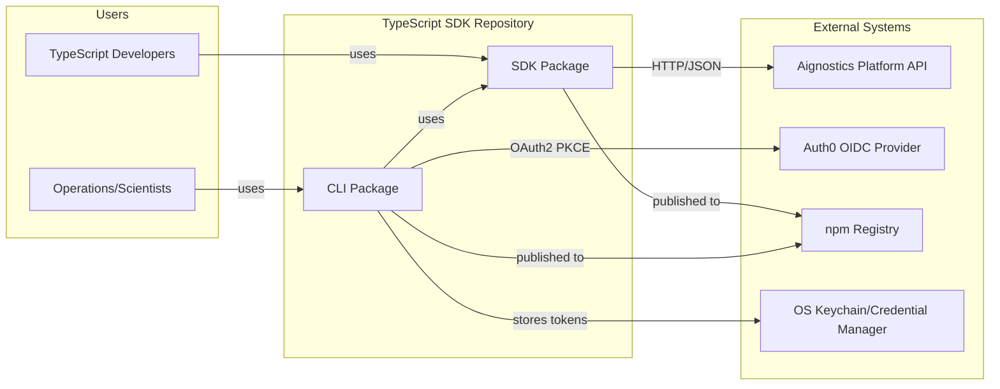

**External Interfaces:**

| System | Interface | Purpose |
|--------|-----------|---------|
| **Aignostics Platform API** | REST (JSON/HTTP) | AI model execution, data retrieval |
| **Auth0** | OAuth2/OIDC | User authentication, token issuance |
| **OS Keychain** | Native API | Secure token storage |
| **npm Registry** | HTTP | Package distribution |

### 3.2 Technical Context

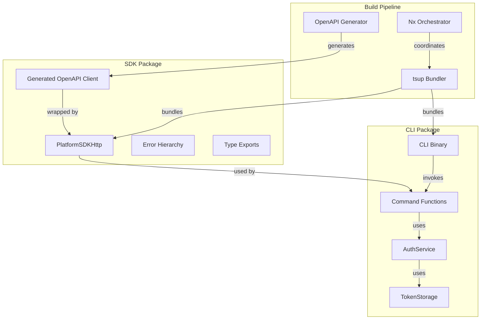

---

## 4. Solution Strategy

### 4.1 Technology Decisions

| Decision | Rationale |
|----------|-----------|
| **Nx Workspace** | Enables independent package publishing with shared tooling |
| **OpenAPI Code Generation** | Maintains API contract alignment, reduces manual coding |
| **Wrapper Pattern** | Abstracts generated code, provides simplified API |
| **Token Provider Pattern** | Enables dynamic token refresh without SDK reinitialization |
| **MSW (Mock Service Worker)** | VCR-like HTTP mocking for realistic tests |
| **Dependency Injection** | Testable authentication with pluggable storage |

### 4.2 Top-Level Decomposition

The system is decomposed into two independently deployable packages:

1. **SDK Package**: Pure library with zero external service dependencies (except Platform API)
2. **CLI Package**: Application that composes SDK with authentication and user interface

**Key Design Principle:** SDK is authentication-agnostic; CLI provides authentication implementation.

### 4.3 Quality Achievement Strategy

| Quality Goal | Strategy |
|--------------|----------|
| **Type Safety** | TypeScript strict mode, auto-generated types from OpenAPI |
| **Testability** | Dependency injection, HTTP mocking, isolated test setup |
| **Security** | OS-native keychain, PKCE OAuth flow, encrypted file fallback |
| **Maintainability** | Code generation, clear package boundaries, comprehensive docs |

---

## 5. Building Block View

### 5.1 Level 1: System Overview

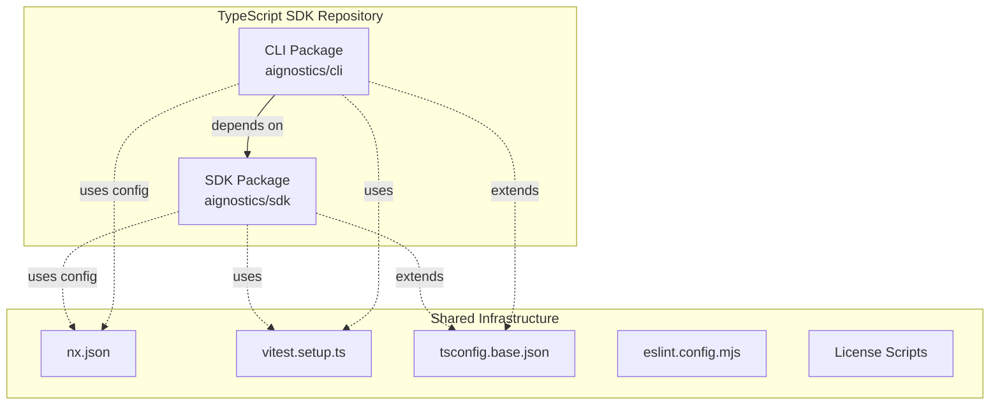

**Package Responsibilities:**

| Package | Responsibility | Exports |
|---------|---------------|---------|
| **@aignostics/sdk** | Platform API client library | `PlatformSDKHttp`, types, errors, test utilities |
| **@aignostics/cli** | Interactive CLI application | Binary executable (`aignostics`) |

### 5.2 Level 2: SDK Package Structure

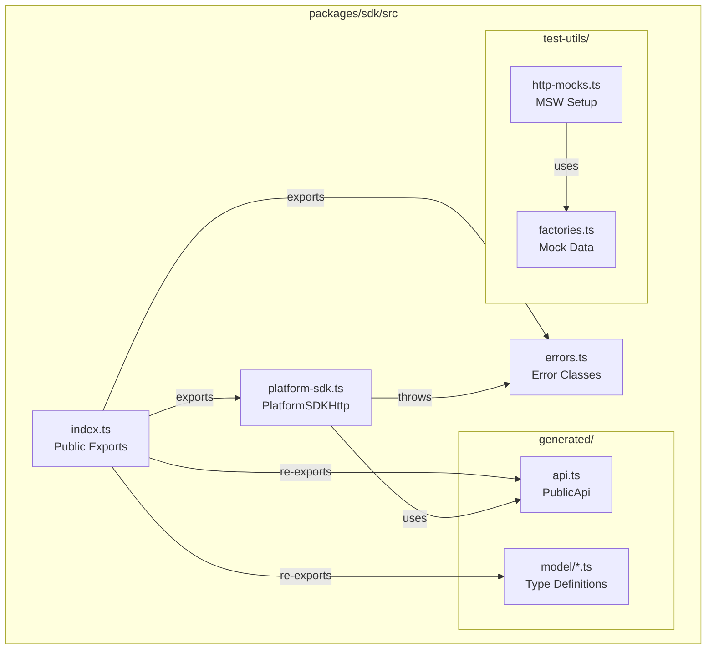

**Key Components:**

- **`index.ts`**: Public API surface (default export, named exports)
- **`platform-sdk.ts`**: Main SDK class implementing `PlatformSDK` interface
- **`errors.ts`**: Error hierarchy (`BaseError`, `APIError`, `AuthenticationError`, etc.)
- **`generated/`**: Auto-generated OpenAPI client (git-ignored, regenerated on build)
- **`test-utils/`**: MSW server, mock scenarios, test factories

### 5.3 Level 2: CLI Package Structure

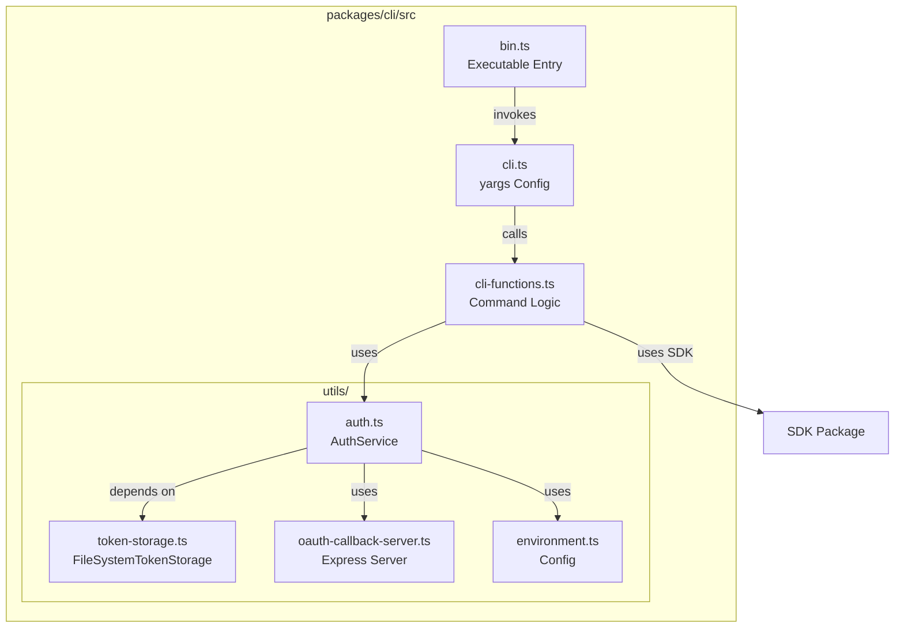

**Key Components:**

- **`bin.ts`**: Executable entry point with shebang (`#!/usr/bin/env node`)
- **`cli.ts`**: yargs command definitions and argument parsing
- **`cli-functions.ts`**: Business logic for each command (SDK initialization, error handling)
- **`utils/auth.ts`**: `AuthService` class for OAuth flows and token management
- **`utils/token-storage.ts`**: OS-native secure storage with file fallback
- **`utils/oauth-callback-server.ts`**: Local Express server for OAuth callback

### 5.4 Level 3: SDK Core Class

**Component:** `PlatformSDKHttp`

**Responsibilities:**
- Token provider invocation
- HTTP client instantiation (per-request fresh client)
- API method wrapping (simplified signatures)
- Error transformation (Axios → SDK errors)

**Interface Implementation:**

```typescript
interface PlatformSDK {
  // Connection
  testConnection(): Promise<boolean>
  
  // Applications
  listApplications(): Promise<ApplicationReadShortResponse[]>
  getApplication(id: string): Promise<ApplicationReadResponse>
  getApplicationVersionDetails(id: string, version: string): Promise<VersionReadResponse>
  
  // Runs
  listApplicationRuns(options?): Promise<RunReadResponse[]>
  createApplicationRun(request): Promise<RunCreationResponse>
  getRun(id: string): Promise<RunReadResponse>
  cancelApplicationRun(id: string): Promise<void>
  listRunResults(id: string): Promise<ItemResultReadResponse[]>
  
  // Metadata
  getVersion(): string
  getConfig(): PlatformSDKConfig
}
```

**Key Design Pattern: Private Client Factory**

The SDK uses `#getClient()` private method that:
1. Invokes `tokenProvider()` to get current access token
2. Throws `AuthenticationError` if no token available
3. Returns fresh `PublicApi` instance with token

**Benefits:**
- Always uses latest token (supports transparent refresh)
- Thread-safe (no shared state)
- Simple implementation

### 5.5 Level 3: CLI Authentication Flow

**Component:** `AuthService`

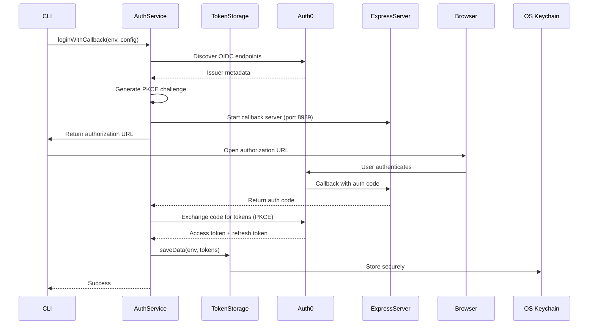

**Key Methods:**

- `loginWithCallback()`: Start OAuth PKCE flow
- `completeLogin()`: Exchange authorization code for tokens
- `loginWithRefreshToken()`: Direct refresh token exchange
- `getValidAccessToken()`: Retrieve token with auto-refresh
- `logout()`: Remove stored tokens
- `getAuthState()`: Check authentication status

---

## 6. Runtime View

### 6.1 Scenario: SDK API Call with Token Refresh

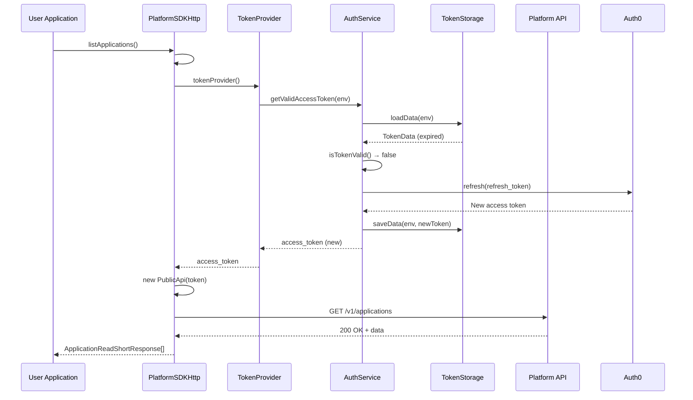

**Key Steps:**
1. SDK invokes token provider (async function)
2. Token provider checks token validity
3. If expired, automatic refresh using refresh token
4. Fresh access token used for API request
5. Success response returned to caller

### 6.2 Scenario: CLI User Login (OAuth PKCE)

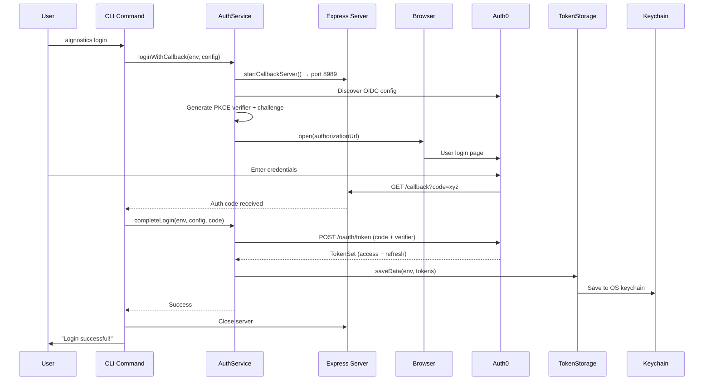

**Key Steps:**
1. Start local Express server on port 8989
2. Generate PKCE code verifier and challenge
3. Open browser to Auth0 authorization URL
4. User authenticates via Auth0 UI
5. Auth0 redirects to `http://localhost:8989/callback?code=...`
6. Exchange authorization code for tokens
7. Save tokens to OS keychain securely
8. Close local server

### 6.3 Scenario: CLI Command Execution

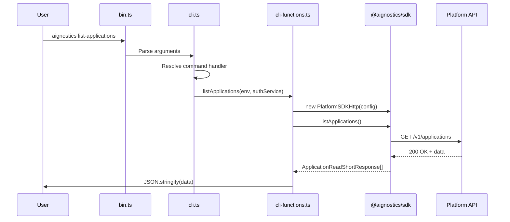

### 6.4 Scenario: Error Handling Flow

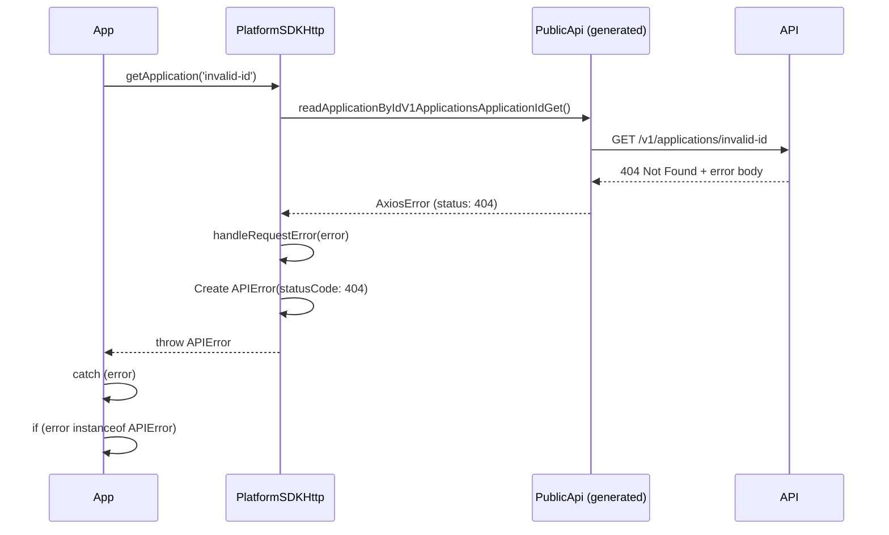

**Error Transformation:**
- Axios errors → `APIError` (with status code)
- Missing token → `AuthenticationError`
- Unknown errors → `UnexpectedError`
- Validation errors (422) → `APIError` with parsed details

---

## 7. Deployment View

### 7.1 npm Package Distribution

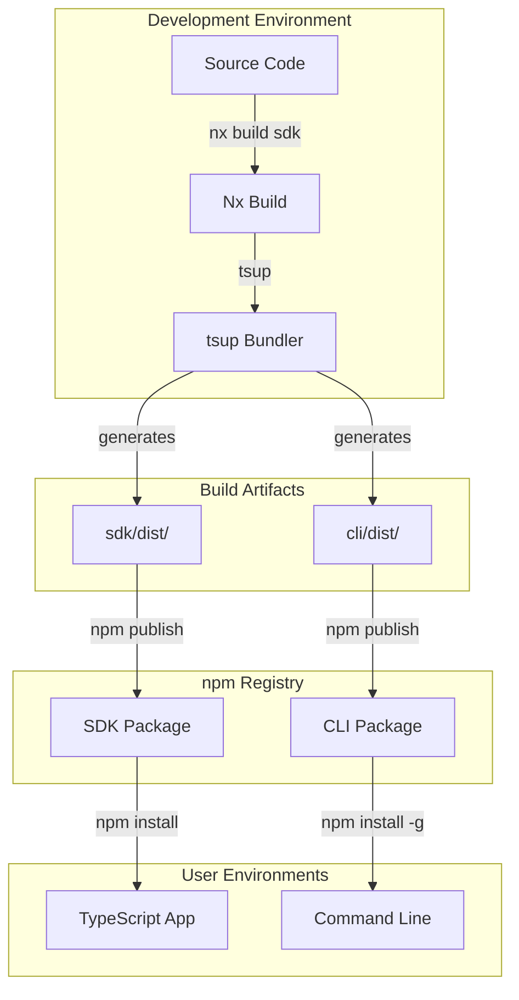

**Package Outputs:**

| Package | Formats | Entry Points |
|---------|---------|--------------|
| **@aignostics/sdk** | ESM + CJS | `dist/index.{js,cjs}`, `dist/test-utils/http-mocks.{js,cjs}` |
| **@aignostics/cli** | ESM + CJS | `dist/bin.{js,cjs}` (executable) |

### 7.2 Token Storage Deployment

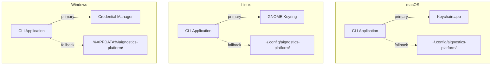

**Storage Strategy:**
- **Primary:** OS-native secure storage via `@napi-rs/keyring`
- **Fallback:** Encrypted JSON file with restricted permissions (0o600)
- **Service Name:** `aignostics-platform`
- **Entry Name:** Environment key (`production`, `staging`, `develop`)

### 7.3 Code Generation Workflow

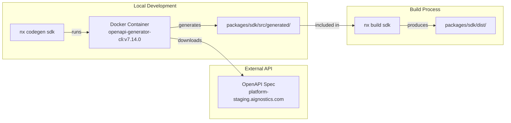

**Code Generation Steps:**
1. Delete existing `packages/sdk/src/generated/`
2. Run Docker container with OpenAPI Generator
3. Download spec from `https://platform-staging.aignostics.com/api/v1/openapi.json`
4. Generate TypeScript Axios client
5. Output to `packages/sdk/src/generated/`

**Important:** Generated code is git-ignored and must be regenerated in CI/CD.

---

## 8. Cross-Cutting Concepts

### 8.1 Error Handling Strategy

**Hierarchy:**

```
BaseError (abstract)
├── AuthenticationError (no token, invalid token)
├── APIError (HTTP errors, validation errors)
├── ConfigurationError (invalid SDK config)
└── UnexpectedError (unknown errors)
```

**Error Context:**
- `code`: Machine-readable error code
- `message`: Human-readable message
- `context`: Additional metadata (response body, validation details)
- `originalError`: Wrapped original error
- `statusCode`: HTTP status (APIError only)

**Usage Pattern:**

Users can handle errors by type:
```typescript
try {
  await sdk.getApplication('id');
} catch (error) {
  if (error instanceof AuthenticationError) {
    // Handle auth issues
  } else if (error instanceof APIError) {
    // Handle API errors (check statusCode)
  }
}
```

### 8.2 Testing Strategy

**Test Types:**

| Type | File Pattern | Scope | Mocking |
|------|-------------|-------|---------|
| **Unit** | `.spec.ts` | Single function/class | Full mocking |
| **Integration** | `.test.ts` | Multiple components | HTTP mocking (MSW) |
| **E2E** | `e2e/**/*.test.ts` | Full CLI flow | Real HTTP (staging) |

**HTTP Mocking Architecture:**

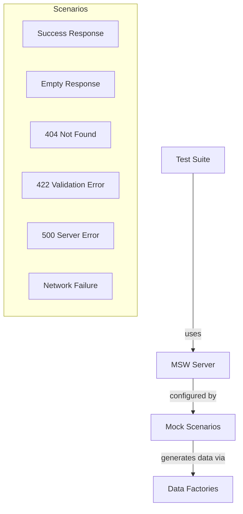

**Mock Scenario Switching:**
```typescript
import { setMockScenario } from '@aignostics/sdk/test';

it('handles 404 errors', async () => {
  setMockScenario('notFound');
  await expect(sdk.getApplication('id')).rejects.toThrow(APIError);
});
```

**Test Isolation:**
- MSW server reset between tests
- Automatic mock cleanup (vitest `unstubAllGlobals`)
- Randomized timezone per test run
- Independent E2E test execution

### 8.3 Configuration Management

**SDK Configuration:**

```typescript
interface PlatformSDKConfig {
  baseURL?: string;           // Default: https://api.aignostics.com
  tokenProvider: TokenProvider; // Required
  timeout?: number;           // Default: 10000ms
}
```

**CLI Configuration:**

Environment-specific settings in `utils/environment.ts`:
```typescript
{
  production: { endpoint, issuerURL, clientID, scope, audience },
  staging: { ... },
  develop: { ... }
}
```

**Environment Selection:**
- CLI flag: `--environment <env>`
- Default: `production`
- Affects: API endpoint, OAuth provider, token storage key

### 8.4 Security Concepts

**Token Protection:**
1. **Primary Storage:** OS-native secure storage (Keychain/Credential Manager)
2. **Fallback Storage:** Encrypted file with restricted permissions (0o600)
3. **Transport:** TLS for all HTTP communication
4. **Memory:** Tokens retrieved on-demand, not held in memory

**OAuth Security:**
- **PKCE Flow:** Prevents authorization code interception
- **Code Verifier:** Random 32-byte hex string
- **Localhost Callback:** Reduces attack surface
- **Token Rotation:** Refresh tokens enable token renewal

**Dependency Security:**
- License policy enforcement (pre-commit hook)
- Automated vulnerability scanning (npm audit in CI)
- Dependency updates monitored

### 8.5 Build and Release

**Build Pipeline:**

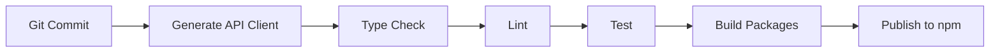

**Nx Build Graph:**
- `sdk:codegen` → `sdk:build` → `cli:build`
- Build cache enabled for faster rebuilds
- Parallel test execution

**Semantic Release:**
- Conventional commits analyzed
- Version bumped automatically
- Changelog generated
- Git tags created
- npm publish (independent package versions)

---

## 9. Architecture Decisions

### 9.1 ADR-001: Wrapper Pattern for Generated Code

**Context:** OpenAPI Generator produces verbose client with complex signatures.

**Decision:** Wrap generated client in `PlatformSDKHttp` class with simplified methods.

**Rationale:**
- Shields users from generated code complexity
- Enables custom error handling
- Allows method signature simplification
- Provides flexibility to change code generator

**Consequences:**
- Additional maintenance layer
- Manual updates when API changes
- Improved developer experience

### 9.2 ADR-002: Token Provider Pattern

**Context:** SDK needs access tokens but shouldn't manage authentication.

**Decision:** Accept `TokenProvider` function that returns current token.

**Rationale:**
- Separates authentication concern from API client
- Enables dynamic token refresh without SDK reinitialization
- Supports multiple authentication strategies (OAuth, API keys, etc.)
- SDK remains authentication-agnostic

**Consequences:**
- Users must implement token management
- CLI handles OAuth + refresh logic
- SDK methods always use fresh tokens

### 9.3 ADR-003: Dependency Injection for Token Storage

**Context:** CLI needs secure token storage with testable implementation.

**Decision:** `AuthService` depends on `TokenStorage` interface.

**Rationale:**
- Enables test mocking (no filesystem in unit tests)
- Supports multiple storage backends
- Clear separation of concerns
- Follows SOLID principles

**Consequences:**
- Slightly more complex initialization
- Improved testability
- Easy to add alternative storage

### 9.4 ADR-004: Dual Storage Strategy (Keychain + File)

**Context:** OS keychain may fail due to permissions or missing dependencies.

**Decision:** Primary storage is OS keychain; fallback to encrypted file.

**Rationale:**
- Best security when keychain available
- Graceful degradation on keychain failure
- User doesn't need to troubleshoot keychain issues
- Works across all environments

**Consequences:**
- More complex storage logic
- Silent fallback (may mask issues)
- File storage less secure than keychain

### 9.5 ADR-005: MSW for HTTP Mocking

**Context:** Need realistic HTTP testing without real API calls.

**Decision:** Use MSW (Mock Service Worker) for network-level mocking.

**Rationale:**
- Tests real HTTP client logic (Axios)
- No need to mock SDK internals
- Scenario-based testing (success, errors, edge cases)
- Realistic request/response handling

**Consequences:**
- Additional test infrastructure
- Excellent test realism
- Shared mocks between SDK and CLI

### 9.6 ADR-006: TypeScript SDK Repository with Independent Publishing

**Context:** SDK and CLI are related but serve different users.

**Decision:** Use Nx workspace for TypeScript SDK repository with independent package versions.

**Rationale:**
- Shared tooling (linting, testing, type checking)
- Independent release cycles
- CLI depends on SDK naturally
- Easier cross-package refactoring

**Consequences:**
- More complex CI/CD (two packages)
- Better separation of concerns
- Improved code reuse

### 9.7 ADR-007: Docker-Based Code Generation

**Context:** OpenAPI Generator requires specific version and dependencies.

**Decision:** Use Docker container for code generation instead of npm package.

**Rationale:**
- Consistent tool version across environments
- No local npm dependency on generator
- Isolated environment for generation
- Easier upgrades (change Docker tag)

**Consequences:**
- Requires Docker locally and in CI
- Slightly slower first-time setup
- Completely reproducible generation

---

## 10. Quality Requirements

### 10.1 Quality Tree

```
Quality
├── Type Safety (High Priority)
│   ├── Strict TypeScript mode
│   ├── Generated types from OpenAPI
│   └── Compile-time error catching
├── Testability (High Priority)
│   ├── 85% code coverage minimum
│   ├── Isolated unit tests
│   ├── Integration tests with MSW
│   └── E2E tests against staging
├── Security (High Priority)
│   ├── OS-native token storage
│   ├── OAuth2 PKCE flow
│   ├── TLS-only communication
│   └── Dependency license validation
├── Maintainability (Medium Priority)
│   ├── Clear package boundaries
│   ├── Automated code generation
│   ├── Comprehensive documentation
│   └── Conventional commits
└── Performance (Lower Priority)
    ├── Build caching (Nx)
    ├── Per-request client creation
    └── Reasonable timeout defaults
```

### 10.2 Quality Scenarios

| Quality Attribute | Scenario | Measure |
|-------------------|----------|---------|
| **Type Safety** | Developer adds new SDK method | Compile error if types mismatch |
| **Testability** | New feature added | Coverage remains ≥ 85% |
| **Security** | CLI stores token | Token saved to OS keychain (not plaintext) |
| **Maintainability** | API endpoint added | Code regeneration updates types automatically |
| **Developer Experience** | User encounters error | Error message clearly indicates problem and solution |
| **Reliability** | Network failure | Graceful error handling, no unhandled exceptions |

### 10.3 Test Coverage Requirements

| Package | Threshold | Metric | Exclusions |
|---------|-----------|--------|------------|
| **SDK** | 85% | Branches, Functions, Lines, Statements | `src/generated/**`, `src/test-utils/**`, `*.test.ts` |
| **CLI** | 85% | Branches, Functions, Lines, Statements | `*.test.ts`, `e2e/**` |

**Enforcement:**
- Vitest coverage reports
- CI pipeline fails if below threshold
- Coverage reports uploaded to Codecov

---

## 11. Risks and Technical Debt

### 11.1 Risks

| Risk | Probability | Impact | Mitigation |
|------|------------|--------|------------|
| **OpenAPI Spec Breaking Changes** | High | High | Versioned code generation, comprehensive tests |
| **Auth0 Service Downtime** | Low | High | Clear error messages, retry logic |
| **OS Keychain Unavailable** | Medium | Low | File storage fallback |
| **Generated Code Quality Issues** | Medium | Medium | Wrapper pattern isolates generated code |
| **Dependency Vulnerabilities** | Medium | Medium | Automated npm audit, license checking |

### 11.2 Technical Debt

| Item | Impact | Priority | Notes |
|------|--------|----------|-------|
| **Single-file CLI Functions** | Low | Low | `cli-functions.ts` could be split if it grows beyond ~500 lines |
| **Test Utilities in SDK Package** | Low | Medium | MSW exports increase package size; consider separate test package |
| **Manual Wrapper Maintenance** | Medium | Medium | SDK methods must be manually updated when API changes |
| **Docker Dependency** | Low | Low | Code generation requires Docker; could add npm fallback |
| **Silent Keychain Fallback** | Low | Medium | File storage fallback happens silently; consider warning |

### 11.3 Future Improvements

**Potential Enhancements:**
1. **SDK Streaming Support:** WebSocket or SSE for real-time run status
2. **CLI Progress Indicators:** Better UX for long-running operations
3. **SDK Retry Logic:** Automatic retry with exponential backoff
4. **CLI Configuration File:** Support for `.aignosticsrc` configuration
5. **SDK Browser Support:** Bundle for browser environments
6. **Multi-Region Support:** Automatic region detection and selection

**Scalability Considerations:**
- SDK is stateless and scales with application
- CLI is single-user, no scaling concerns
- Token refresh handles long-running sessions
- Build pipeline could benefit from better caching

---

## Appendix A: Glossary

| Term | Definition |
|------|------------|
| **Application** | AI model or processing pipeline on Aignostics Platform |
| **Run** | Execution of an application on a set of data items |
| **Token Provider** | Async function that returns current access token |
| **PKCE** | Proof Key for Code Exchange (OAuth security extension) |
| **MSW** | Mock Service Worker (HTTP mocking library) |
| **Nx** | Build system and task orchestrator for typescript sdk monorepo |
| **Arc42** | Documentation template for software architecture |

## Appendix B: References

- [Nx Documentation](https://nx.dev)
- [OpenAPI Generator](https://openapi-generator.tech)
- [Arc42 Template](https://arc42.org)
- [OAuth 2.0 PKCE](https://oauth.net/2/pkce/)
- [MSW Documentation](https://mswjs.io)
- [Conventional Commits](https://www.conventionalcommits.org)

---

**Document Version:** 1.0  
**Last Updated:** December 2, 2025  
**Maintained By:** Aignostics Platform Team
