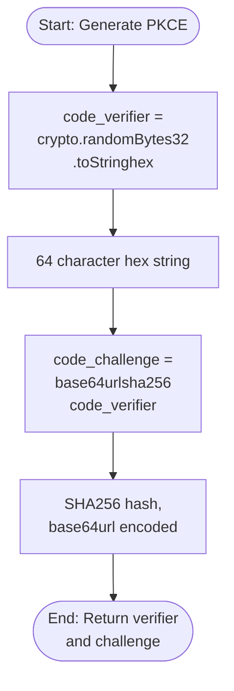
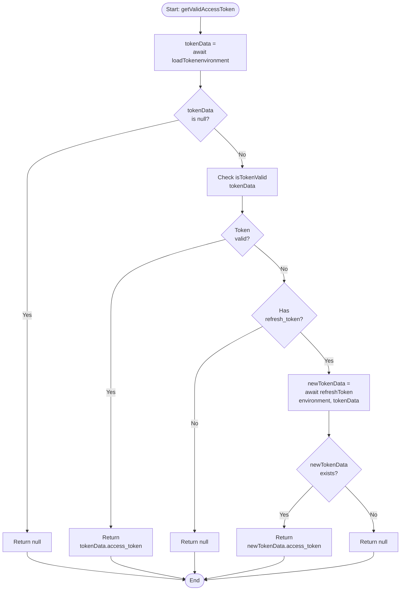
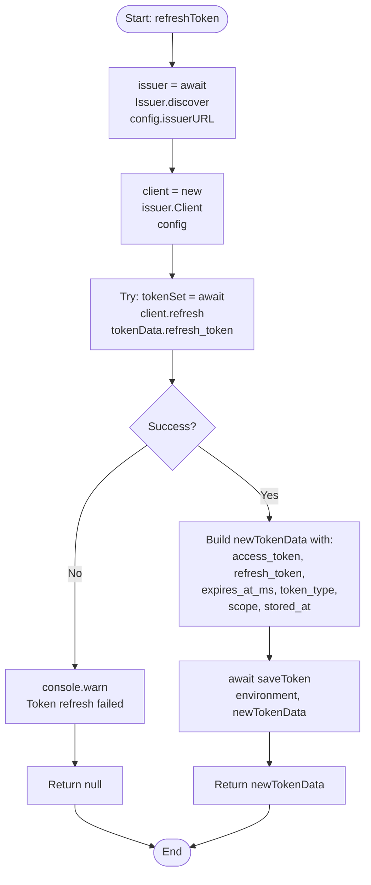

## 1. Purpose and Scope

### 1.1 Software Item Purpose
The CLI Application provides a command-line interface for interacting with the Aignostics Platform API. It implements OAuth2 authorization code flow with PKCE for secure authentication, manages authentication tokens using the Token Storage component, and exposes all SDK functionality through intuitive CLI commands. The CLI handles user authentication, token lifecycle management, and provides formatted output for both human-readable and machine-parsable formats.

### 1.2 Scope
This specification covers:
- Command-line interface implementation using yargs framework
- OAuth2 authorization code flow with PKCE (Proof Key for Code Exchange)
- Local callback server for OAuth redirect handling
- Authentication service integrating token storage and refresh logic
- Token lifecycle management (login, logout, refresh, validation, status)
- Application management commands (list, get details, get versions)
- Application run commands (create, list, get, cancel)
- Results retrieval commands
- Error handling and formatted CLI output
- Environment configuration (production, staging, development)

This specification excludes:
- HTTP API client implementation (provided by SDK)
- Error class definitions (provided by Error Management component)
- OS-native token storage (provided by Token Storage component)
- OpenAPI code generation
- Web-based UI or GUI components

## 2. Requirements Traceability

### 2.1 Parent Software Requirements
| SWR ID | Title | Implementation Approach |
|--------|-------|------------------------|
| SWR-AUTH-CODE-FLOW | Secure Authorisation Code Authentication | Implemented through AuthService.loginWithCallback() using OAuth2 PKCE with code_verifier and code_challenge (S256); local callback server receives authorization code; tokens exchanged via openid-client library |
| SWR-AUTH-SECURE-STORAGE | Secure Token Storage | AuthService depends on TokenStorage interface; FileSystemTokenStorage provides secure storage; token data saved with stored_at timestamp for lifecycle tracking |
| SWR-AUTH-AUTO-REFRESH | Automatic Token Refresh | AuthService.getValidAccessToken() checks token expiration and automatically calls refreshToken() when expired; refresh uses OIDC client.refresh() with refresh_token; SDK tokenProvider calls getValidAccessToken() on each request |
| SWR-AUTH-TOKEN-REMOVAL | Token Removal | Implemented through handleLogout() calling AuthService.logout() which invokes tokenStorage.remove(); logout command available in CLI |
| SWR-AUTH-VALIDATION | Authentication Validation | AuthService.getValidAccessToken() validates token existence, parses with Zod schema, checks expiration timestamp; returns null if invalid; SDK throws AuthenticationError when tokenProvider returns null |
| SWR-ERROR-COMM-CLI-OUTPUT | CLI Error Output | All commands write errors to stderr via console.error(); yargs .fail() handler formats errors with ❌ prefix; process.exit(1) provides machine-readable status; structured error properties enable appropriate formatting |

### 2.2 Requirements Coverage Analysis
All six SWRs are fully implemented:
- **Code Flow**: Complete OAuth2 PKCE implementation with crypto-secure code_verifier generation, local callback server on dynamic port, and browser-based authorization
- **Secure Storage**: AuthService uses TokenStorage interface; production implementation uses FileSystemTokenStorage with OS keychain
- **Auto Refresh**: Token expiration checked before each API call; automatic refresh with existing refresh token; transparent to user
- **Token Removal**: Logout command removes tokens from all storage layers; logout functionality integrated into AuthService
- **Validation**: Multi-layer validation including existence check, Zod schema validation, expiration timestamp verification
- **CLI Output**: Consistent error formatting with stderr output, error prefixes (❌, ✅), and exit code 1 for all failures

## 3. Design Specification

### 3.1 Architecture Overview
The CLI Application follows a layered architecture with command handlers (cli.ts, cli-functions.ts), authentication service (AuthService), OAuth callback server, and environment configuration. The CLI uses yargs for command parsing and routing, delegates authentication to AuthService which manages token lifecycle through TokenStorage interface, and uses SDK for all API operations. The OAuth flow uses a temporary Express server to receive the authorization code callback.

**Architecture Diagram Reference**: See `/docs/SOFTWARE_ARCHITECTURE.md` Section 5.2 (CLI Package Structure) and Section 6.2 (Authentication Flow)

### 3.2 Interfaces

#### 3.2.1 Public Interfaces
**Exported API**:
```typescript
// Main CLI entry point
export async function main(): Promise<void>;

// Command handler functions (exported for testing)
export function handleInfo(): void;
export async function testApi(environment: EnvironmentKey, authService: AuthService): Promise<void>;
export async function listApplications(environment: EnvironmentKey, authService: AuthService): Promise<void>;
export async function getApplicationVersionDetails(environment: EnvironmentKey, authService: AuthService, applicationId: string, versionNumber: string): Promise<void>;
export async function listApplicationVersions(environment: EnvironmentKey, authService: AuthService, applicationId: string): Promise<void>;
export async function listApplicationRuns(environment: EnvironmentKey, authService: AuthService, options?: { applicationId?: string; applicationVersion?: string }): Promise<void>;
export async function createApplicationRun(environment: EnvironmentKey, authService: AuthService, applicationId: string, versionNumber: string, itemsJson: string): Promise<void>;
export async function getRun(environment: EnvironmentKey, authService: AuthService, applicationRunId: string): Promise<void>;
export async function cancelApplicationRun(environment: EnvironmentKey, authService: AuthService, applicationRunId: string): Promise<void>;
export async function listRunResults(environment: EnvironmentKey, authService: AuthService, applicationRunId: string): Promise<void>;
export async function handleLogin(environment: EnvironmentKey, authService: AuthService): Promise<void>;
export async function handleLoginWithRefreshToken(environment: EnvironmentKey, refreshToken: string, authService: AuthService): Promise<void>;
export async function handleLogout(environment: EnvironmentKey, authService: AuthService): Promise<void>;
export async function handleStatus(environment: EnvironmentKey, authService: AuthService): Promise<void>;

// Authentication Service
export class AuthService {
  constructor(tokenStorage: TokenStorage);
  async loginWithCallback(environment: EnvironmentKey, config: LoginWithCallbackConfig): Promise<string>;
  async completeLogin(environment: EnvironmentKey, config: LoginWithCallbackConfig, authCode: string): Promise<void>;
  async loginWithRefreshToken(environment: EnvironmentKey, refreshToken: string): Promise<void>;
  async getValidAccessToken(environment: EnvironmentKey): Promise<string | null>;
  async getAuthState(environment: EnvironmentKey): Promise<AuthState>;
  async logout(environment: EnvironmentKey): Promise<void>;
}

// OAuth Callback Server
export async function startCallbackServer(port?: number): Promise<Server>;
export async function waitForCallback(server: Server): Promise<string>;
```

#### 3.2.2 Internal Interfaces
**OAuth Configuration**:
```typescript
interface LoginWithCallbackConfig {
  redirectUri: string;     // http://localhost:{port}
  codeVerifier: string;    // Crypto-secure random string
}

interface EnvironmentConfig {
  issuerURL: string;       // OAuth issuer URL
  clientID: string;        // OAuth client ID
  audience: string;        // OAuth audience
  scope: string;           // OAuth scope
  endpoint: string;        // API endpoint URL
}
```

**Token Data Schema**:
```typescript
const tokenSchema = z.object({
  access_token: z.string(),
  refresh_token: z.string().nullable().default(null),
  expires_at_ms: z.number().nullable().default(null),
  token_type: z.string().nullable().default(null),
  scope: z.string().nullable().default(null),
  stored_at: z.number(),
});
```

#### 3.2.3 External Dependencies
**Third-Party Libraries**:
| Package | Version | Purpose | Justification |
|---------|---------|---------|---------------|
| yargs | ^17.7.2 | Command-line argument parsing and routing | Industry-standard CLI framework; type-safe; extensive middleware support; good developer experience |
| openid-client | ^5 | OAuth2/OIDC client implementation | Official OIDC certified library; handles PKCE, token exchange, refresh; secure implementation |
| express | ^5.1.0 | HTTP server for OAuth callback | Minimal server for redirect URI; well-tested; simple setup |
| open | ^10.2.0 | Cross-platform browser opening | Reliable browser launch; supports all major platforms; no alternative needed |
| zod | ^4.0.5 | Runtime type validation for token data | Type-safe validation; clear error messages; prevents runtime errors |
| @napi-rs/keyring | ^1.1.8 | OS-native secure storage (via Token Storage) | Required by Token Storage component |

**Internal Dependencies**:
| Package | Purpose |
|---------|---------|
| @aignostics/sdk | API client and error types |
| Token Storage component | Secure token persistence |
| Error Management component | Structured error handling |

### 3.3 Data Structures

#### 3.3.1 Core Data Models
```typescript
// Token Data (persisted to storage)
interface TokenData {
  access_token: string;           // OAuth access token
  refresh_token: string | null;   // OAuth refresh token (optional)
  expires_at_ms: number | null;   // Expiration timestamp in milliseconds
  token_type: string | null;      // Token type (typically "Bearer")
  scope: string | null;           // OAuth scope
  stored_at: number;              // Storage timestamp in milliseconds
}

// Authentication State (for status command)
interface AuthState {
  isAuthenticated: boolean;
  token?: {
    type: string;           // Token type
    scope: string;          // OAuth scope
    expiresAt?: Date;       // Expiration date
    storedAt: Date;         // Storage date
  };
}

// Environment Configuration
type EnvironmentKey = 'production' | 'staging' | 'development';

const environmentConfig: Record<EnvironmentKey, EnvironmentConfig> = {
  production: {
    issuerURL: 'https://auth.aignostics.com',
    clientID: 'production-client-id',
    audience: 'https://api.aignostics.com',
    scope: 'openid profile email offline_access',
    endpoint: 'https://api.aignostics.com',
  },
  // ... staging, development configs
};
```

#### 3.3.2 Data Flow
**Login Flow**:
1. User runs `aignostics-platform login --environment production`
2. CLI generates crypto-secure code_verifier (32 bytes hex)
3. CLI starts local Express server on port 8989 (or dynamic)
4. CLI creates OAuth authorization URL with code_challenge (SHA256 of code_verifier)
5. CLI opens browser to authorization URL
6. User authenticates with OAuth provider (Auth0)
7. OAuth provider redirects to http://localhost:8989?code=AUTH_CODE
8. Express server captures authorization code
9. CLI exchanges code for tokens using code_verifier
10. AuthService validates token with Zod schema
11. TokenStorage saves token data
12. CLI displays success message

**API Request Flow**:
1. User runs command (e.g., `aignostics-platform list-applications`)
2. Command handler creates SDK with tokenProvider: () => authService.getValidAccessToken(environment)
3. SDK calls tokenProvider to get token
4. AuthService.getValidAccessToken() loads token from storage
5. If token expired and refresh_token exists, AuthService.refreshToken() called automatically
6. Fresh token returned to SDK
7. SDK makes API request with token in Authorization header
8. Response formatted and printed to stdout
9. Errors caught and formatted to stderr with exit code 1

### 3.4 Algorithms and Logic

#### 3.4.1 Core Algorithms
**PKCE Code Challenge Generation**:


**Token Validation Algorithm**:


**Token Refresh Algorithm**:


#### 3.4.2 State Management
**AuthService State**: Stateless - no in-memory state; all state in TokenStorage
**CLI State**: Stateless per-command - each command execution independent
**OAuth Server State**: Temporary - Promise-based callback waiting, server closed after code received

#### 3.4.3 Control Flow
**Command Execution Flow**:
1. yargs parses command and arguments
2. Command handler function called with parsed arguments
3. Handler creates SDK with tokenProvider function
4. Handler calls SDK method
5. SDK executes API request (tokenProvider called internally)
6. Response formatted and output to stdout
7. On error: yargs .fail() handler catches, formats error to stderr, exits with code 1

**Error Flow**:
1. Error thrown in command handler or SDK
2. yargs .fail() handler catches error
3. If AuthenticationError: specific message to re-login
4. Else: generic error message with error details
5. console.error() writes to stderr
6. process.exit(1) terminates with failure code

### 3.5 Error Handling

#### 3.5.1 Error Classification
**CLI Error Types**:
- **Authentication Errors**: No token, expired token, invalid token, refresh failed
- **API Errors**: Network failures, HTTP errors, validation errors
- **Configuration Errors**: Invalid environment, missing config
- **Input Errors**: Invalid command arguments, malformed JSON
- **System Errors**: OAuth server start failure, browser launch failure

#### 3.5.2 Error Handling Strategy
**Global Error Handler**:
- yargs .fail() middleware catches all uncaught errors
- AuthenticationError gets special handling with re-login prompt
- All errors formatted with ❌ prefix for consistency
- Error details included in message (error.message or String(error))

**Command-Level Error Handling**:
- Try-catch blocks in command handlers
- Specific error messages for known scenarios (e.g., JSON parse error)
- process.exit(1) ensures failure propagation to shell

**Authentication Error Recovery**:
- Token load failure → Return null → SDK throws AuthenticationError → User prompted to login
- Token expired + refresh failed → Return null → Same flow
- Explicit error message: "Authentication error, please use the login command to reauthenticate"

#### 3.5.3 Error Recovery
**Automatic Recovery**:
- Expired tokens automatically refreshed transparently
- OAuth server port conflicts → Retry with dynamic port (0)

**Manual Recovery**:
- Authentication failures require user to run `login` command
- Corrupted token storage requires logout and re-login
- Invalid JSON in command arguments → User must correct input

### 3.6 Security Considerations

#### 3.6.1 Authentication
**OAuth2 Authorization Code Flow with PKCE**:
- code_verifier: 32 bytes crypto-secure random (64 char hex)
- code_challenge: SHA256 hash of code_verifier, base64url encoded
- Prevents authorization code interception attacks
- No client secret required (public client)

**Token Handling**:
- Access tokens stored securely via TokenStorage component
- Refresh tokens stored alongside access tokens
- Tokens never logged or displayed in CLI output
- Tokens transmitted only over HTTPS

#### 3.6.2 Authorization
Authorization handled by API server - CLI only provides valid access token in Authorization header.

#### 3.6.3 Data Protection
**Token Protection**:
- Stored via Token Storage component (OS keychain + file fallback)
- No tokens in command-line arguments or environment variables
- No tokens in CLI output (only success/failure messages)

**Sensitive Data in Logs**:
- Error context may contain sensitive data - not sanitized by CLI
- Users responsible for not passing sensitive data in command arguments

#### 3.6.4 Input Validation
**Command Arguments**:
- yargs validates argument types and required fields
- JSON input parsed and validated before sending to API
- Invalid JSON caught with clear error message

**Environment Selection**:
- Restricted to defined environment keys via yargs .choices()
- Invalid environments rejected before command execution

## 4. Implementation Details

### 4.1 Technology Stack
**Languages**: TypeScript 5.8.3
**Runtime**: Node.js ≥18.0.0
**Build Tools**: tsup (bundler), tsc (type checking)
**Testing Framework**: Vitest (unit tests), E2E tests with real API
**CLI Framework**: yargs 17.7.2

### 4.2 File Structure
```
packages/cli/src/
├── index.ts                     # Re-exports cli.ts
├── cli.ts                       # Main CLI implementation with yargs (150 lines)
├── cli-functions.ts             # Command handler functions (320 lines)
└── utils/
    ├── auth.ts                  # AuthService implementation (270 lines)
    ├── token-storage.ts         # Token storage implementation (270 lines)
    ├── oauth-callback-server.ts # Express callback server (80 lines)
    └── environment.ts           # Environment configuration (50 lines)
```

### 4.3 Key Components
| Component | Type | Purpose | File Location |
|-----------|------|---------|---------------|
| main | Function | CLI entry point with yargs configuration | cli.ts:18-180 |
| authService | Instance | Shared AuthService instance for all commands | cli.ts:15 |
| handleLogin | Function | OAuth login flow orchestration | cli-functions.ts:150-185 |
| AuthService | Class | Authentication lifecycle management | auth.ts:50-250 |
| loginWithCallback | Method | Initiate OAuth PKCE flow | auth.ts:90-120 |
| completeLogin | Method | Exchange code for tokens | auth.ts:125-160 |
| getValidAccessToken | Method | Get token with auto-refresh | auth.ts:185-220 |
| startCallbackServer | Function | Start Express server for OAuth callback | oauth-callback-server.ts:15-45 |
| waitForCallback | Function | Wait for authorization code | oauth-callback-server.ts:50-70 |

### 4.3 Configuration
**Environment Configuration**:
| Environment | Issuer URL | Client ID | API Endpoint |
|------------|-----------|-----------|--------------|
| production | https://auth.aignostics.com | prod-client-id | https://api.aignostics.com |
| staging | https://auth-staging.aignostics.com | staging-client-id | https://platform-staging.aignostics.com |
| development | https://auth-dev.aignostics.com | dev-client-id | https://platform-dev.aignostics.com |

**OAuth Configuration**:
| Parameter | Value | Description |
|-----------|-------|-------------|
| scope | openid profile email offline_access | Required scopes |
| response_type | code | Authorization code flow |
| code_challenge_method | S256 | SHA256 PKCE |
| redirect_uri | http://localhost:{port} | Dynamic port |

### 4.4 Dependencies Management
**Production Dependencies**:
- @aignostics/sdk: Internal monorepo dependency (linked via Nx)
- External dependencies managed via package.json with caret (^) versioning
- Native modules (@napi-rs/keyring) include pre-built binaries for major platforms

**Development Dependencies**:
- @types packages for TypeScript support
- Testing utilities (Vitest, MSW not needed for CLI tests)

## 5. Verification Criteria

### 5.1 Unit Test Requirements

**Test Coverage Areas**:
- [x] Command parsing and routing (yargs integration)
- [x] Command handler functions with mocked SDK
- [x] AuthService token validation logic
- [x] AuthService refresh token logic
- [x] OAuth callback server start/stop
- [x] Error handling and formatting
- [x] JSON input parsing for create-run command
- [x] Environment configuration selection

**Test Files**:
- `cli.test.ts`: CLI command parsing and routing
- `cli-functions.spec.ts`: Command handler unit tests
- `auth.spec.ts`: AuthService unit tests
- `oauth-callback-server.spec.ts`: Callback server tests

### 5.2 Integration Test Requirements

**Integration Test Scenarios**:
- [x] Complete authentication flow (login → API call → logout)
- [x] Token refresh during API calls
- [x] Application discovery commands
- [x] Application execution workflow (create run → get status → get results)
- [x] Run management (list, get, cancel)
- [x] Error scenarios (invalid tokens, expired tokens, API errors)

**Test Files**:
- `0-base.e2e.test.ts`: Base CLI functionality
- `1-Authentication.e2e.test.ts`: Full OAuth flow
- `2-Application Discovery.e2e.test.ts`: Application commands
- `3-Application-execution.e2e.test.ts`: Run creation
- `4-Applicatioin-run-management.e2e.test.ts`: Run management
- `5-Application-results-access.e2e.test.ts`: Results retrieval

## 6. Risk Analysis

### 6.1 Identified Risks
| Risk | Probability | Impact | Mitigation Strategy |
|------|------------|--------|---------------------|
| OAuth callback server port conflict | Low | Medium | Fallback to dynamic port (0); clear error message if server start fails |
| Browser fails to open for OAuth | Low | Medium | Display authorization URL in terminal; user can manually open |
| Token refresh fails silently | Low | High | Clear error messages; automatic re-login prompt; logging of refresh failures |
| Sensitive data in command arguments logged | Medium | Medium | Document that arguments may be logged by shell; avoid passing secrets in arguments |
| OAuth state parameter not validated | High | High | PKCE provides protection; consider adding state parameter in future |
| Token stored in file fallback readable by admin | Medium | Medium | Primary storage uses OS keychain; file fallback documented as less secure |

### 6.2 Third-Party Library Risks (SOUP Analysis)
| Library | Risk | Mitigation |
|---------|------|------------|
| yargs@^17.7.2 | Breaking changes in minor versions | Extensive test coverage catches breaking changes; widely used and stable |
| openid-client@^5 | Security vulnerabilities in OIDC implementation | OIDC certified library; regular security updates; monitor npm audit |
| express@^5.1.0 | Server vulnerabilities (temporary server) | Server only listens on localhost; closed immediately after callback; minimal attack surface |
| open@^10.2.0 | Command injection via browser launch | No user input passed to open(); only static URLs used |

## 7. Maintenance and Evolution

### 7.1 Known Limitations
- No support for device code flow (headless environments)
- No support for client credentials flow (service accounts)
- OAuth state parameter not implemented (PKCE provides protection)
- No command aliases or short forms
- No command history or autocomplete
- No progress bars for long-running operations
- No support for custom token providers (hardcoded OAuth)
