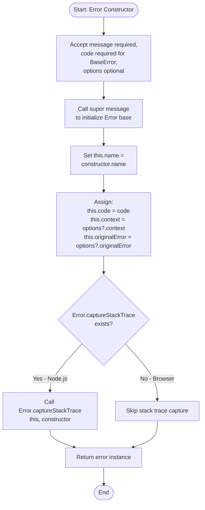
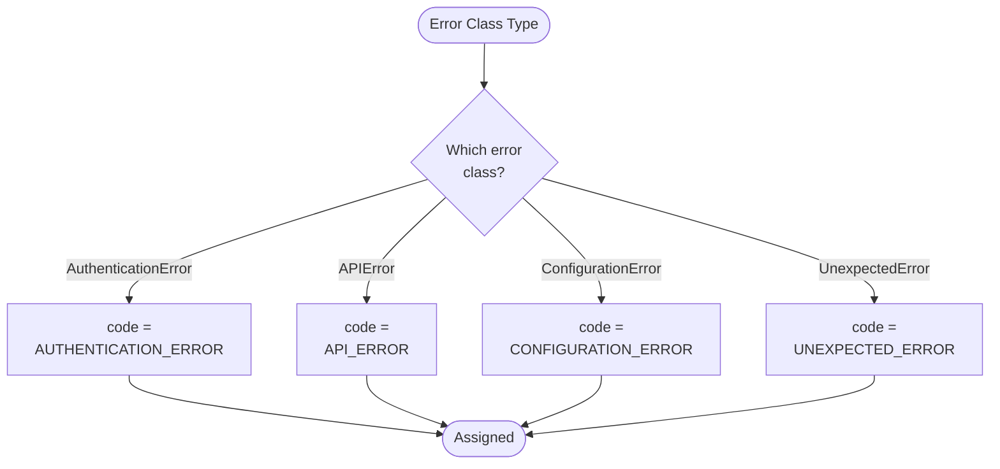

## 1. Purpose and Scope

### 1.1 Software Item Purpose

The Error Management component provides a hierarchical error classification system with consistent error handling capabilities across the TypeScript SDK Repository. It implements structured error types with diagnostic context, enabling programmatic error handling, meaningful user messages, and comprehensive debugging information for both SDK and CLI packages.

### 1.2 Scope

This specification covers:

- Base error class with common error properties and context management
- Specialized error types for different failure scenarios (authentication, API, configuration, unexpected)
- Error code enumeration for programmatic error handling
- Context preservation and original error chaining
- Stack trace management

This specification excludes:

- HTTP request/response handling (handled by SDK)
- User-facing error output formatting (handled by CLI)
- Logging and monitoring infrastructure
- Error recovery mechanisms (handled by consuming code)

## 2. Requirements Traceability

### 2.1 Parent Software Requirements

| SWR ID                            | Title                    | Implementation Approach                                                                                                                                                            |
| --------------------------------- | ------------------------ | ---------------------------------------------------------------------------------------------------------------------------------------------------------------------------------- |
| SWR-ERROR-COMM-CLASSIFICATION     | Error Classification     | Implemented through ErrorCode enumeration and typed error classes (BaseError, AuthenticationError, APIError, ConfigurationError, UnexpectedError) with unique codes per error type |
| SWR-ERROR-COMM-MESSAGES           | Error Messages           | Each error class constructor accepts human-readable message parameter; error messages describe failure cause and provide context for corrective action                             |
| SWR-ERROR-COMM-DIAGNOSTIC-CONTEXT | Error Diagnostic Context | BaseError includes context record for arbitrary diagnostic data, originalError field for error chaining, and statusCode field in APIError for HTTP status information              |
| SWR-ERROR-COMM-CLI-OUTPUT         | CLI Error Output         | Error classes provide structured data that CLI can format for stderr output; error codes and messages enable machine-readable exit status determination                            |

### 2.2 Requirements Coverage Analysis

All four SWRs are fully implemented through the error hierarchy:

- **Classification**: ErrorCode type provides programmatic identifiers; each error class maps to specific code
- **Messages**: Constructor parameters enforce descriptive messages; error.message property accessible to all consumers
- **Diagnostic Context**: context and originalError properties preserve debugging information; APIError extends with statusCode for HTTP diagnostics
- **CLI Output**: Structured error properties enable CLI to format errors appropriately for stderr and determine exit codes

## 3. Design Specification

### 3.1 Architecture Overview

The Error Management component implements a class-based inheritance hierarchy with a common BaseError abstract class extended by specific error types. Each error type represents a distinct failure category with appropriate context fields. The design follows TypeScript error handling best practices with Error.captureStackTrace support for Node.js environments.

**Architecture Diagram Reference**: See `/docs/SOFTWARE_ARCHITECTURE.md` Section 8.6 (Error Handling)

### 3.2 Interfaces

#### 3.2.1 Public Interfaces

**Exported API**:

```typescript
// Error Code Enumeration
export type ErrorCode =
  | 'AUTHENTICATION_ERROR'
  | 'API_ERROR'
  | 'CONFIGURATION_ERROR'
  | 'UNEXPECTED_ERROR';

// Base Error Options
interface BaseErrorOptions {
  context?: Record<string, unknown>;
  originalError?: unknown;
}

// Base Error Class (Abstract)
export class BaseError extends Error {
  public readonly code: ErrorCode;
  public readonly context?: Record<string, unknown>;
  public readonly originalError?: unknown;

  constructor(message: string, code: ErrorCode, options?: BaseErrorOptions);
}

// Specialized Error Classes
export class AuthenticationError extends BaseError {
  constructor(message: string, options?: BaseErrorOptions);
}

export class APIError extends BaseError {
  public readonly statusCode?: number;

  constructor(message: string, options?: BaseErrorOptions & { statusCode?: number });
}

export class ConfigurationError extends BaseError {
  constructor(message: string, options?: BaseErrorOptions);
}

export class UnexpectedError extends BaseError {
  constructor(message: string, options?: BaseErrorOptions);
}
```

#### 3.2.2 Internal Interfaces

All interfaces are public; no internal-only interfaces exist in this component.

#### 3.2.3 External Dependencies

**Third-Party Libraries**: None - uses only Node.js/browser built-in Error class

**Internal Dependencies**:
| Package | Purpose |
|---------|---------|
| None | Error Management has no internal dependencies |

### 3.3 Data Structures

#### 3.3.1 Core Data Models

```typescript
// Error Code Type - Union of string literals
type ErrorCode = 'AUTHENTICATION_ERROR' | 'API_ERROR' | 'CONFIGURATION_ERROR' | 'UNEXPECTED_ERROR';

// Base Error Options Interface
interface BaseErrorOptions {
  context?: Record<string, unknown>; // Arbitrary diagnostic data
  originalError?: unknown; // Original error for chaining
}

// Error Class Properties
class BaseError {
  name: string; // Constructor name (e.g., "AuthenticationError")
  message: string; // Human-readable error message
  code: ErrorCode; // Programmatic error identifier
  context?: Record<string, unknown>; // Additional context data
  originalError?: unknown; // Original error that caused this error
  stack?: string; // Stack trace (inherited from Error)
}

// API Error Extension
class APIError extends BaseError {
  statusCode?: number; // HTTP status code for API failures
}
```

#### 3.3.2 Data Flow

1. Error occurs in SDK or CLI code
2. Error constructor called with message and optional context/originalError
3. BaseError constructor sets code, context, originalError, and captures stack trace
4. Error.captureStackTrace called (Node.js only) to maintain clean stack traces
5. Error object returned to caller with all properties populated
6. Caller can inspect code for programmatic handling, message for display, and context/originalError for debugging

### 3.4 Algorithms and Logic

#### 3.4.1 Core Algorithms

**Error Construction Algorithm**:



**Error Code Assignment**:



#### 3.4.2 State Management

Error classes are immutable once constructed. All properties are readonly to prevent modification after creation.

#### 3.4.3 Control Flow

Linear construction flow with no branching except for conditional Error.captureStackTrace call (Node.js environment check).

### 3.5 Error Handling

#### 3.5.1 Error Classification

**Error Types**:

- **AuthenticationError**: Authentication failures, missing credentials, invalid tokens, token expiration
- **APIError**: API request failures, network errors, HTTP errors, invalid responses
- **ConfigurationError**: Invalid SDK/CLI configuration, missing required parameters, malformed config
- **UnexpectedError**: Unhandled exceptions, unknown errors, system failures

#### 3.5.2 Error Handling Strategy

This component defines error types but does not handle errors. Error handling is the responsibility of consuming code:

- SDK catches errors and transforms them into appropriate error types
- CLI catches errors and formats them for stderr output
- Applications using SDK/CLI catch errors and implement recovery logic

#### 3.5.3 Error Recovery

No recovery mechanisms provided by this component. Recovery is handled by consumers based on error code and context.

### 3.6 Security Considerations

#### 3.6.1 Authentication

Not applicable - this component does not handle authentication, only reports authentication errors.

#### 3.6.2 Authorization

Not applicable - this component does not enforce authorization.

#### 3.6.3 Data Protection

**Context Sanitization**: Consumers must sanitize sensitive data before adding to error context. Error classes do not automatically redact sensitive information.

**Stack Trace Security**: Stack traces may contain sensitive file paths or data. In production, consider filtering stack traces before logging or displaying to users.

#### 3.6.4 Input Validation

Error messages are not validated or sanitized. Consumers should avoid including unsanitized user input directly in error messages to prevent injection attacks in logs or UI.

## 4. Implementation Details

### 4.1 Technology Stack

**Languages**: TypeScript 5.8.3
**Runtime**: Node.js ≥22.14.0 (also compatible with modern browsers)
**Build Tools**: tsup (bundler), tsc (type checking)
**Testing Framework**: Vitest

### 4.2 File Structure

```
packages/sdk/src/
└── errors.ts                # All error classes and types (145 lines)
```

### 4.3 Key Components

| Component           | Type      | Purpose                                                 | File Location     |
| ------------------- | --------- | ------------------------------------------------------- | ----------------- |
| ErrorCode           | Type      | Error code enumeration for programmatic handling        | errors.ts:1-5     |
| BaseErrorOptions    | Interface | Options for error construction (context, originalError) | errors.ts:7-10    |
| BaseError           | Class     | Abstract base error with common properties              | errors.ts:17-50   |
| AuthenticationError | Class     | Authentication failure errors                           | errors.ts:58-69   |
| APIError            | Class     | API request failure errors with HTTP status             | errors.ts:77-97   |
| ConfigurationError  | Class     | Configuration validation errors                         | errors.ts:104-114 |
| UnexpectedError     | Class     | Unexpected/unknown errors                               | errors.ts:116-126 |

### 4.4 Configuration

No configuration parameters - error classes are used directly with no external configuration.

### 4.5 Dependencies Management

No dependencies - uses only TypeScript standard library and Node.js/browser Error class.

## 5. Verification Criteria

### 5.1 Unit Test Requirements

**Test Coverage Areas**:

- [x] BaseError construction with all parameter combinations
- [x] Error code assignment for each error type
- [x] Context and originalError preservation
- [x] Stack trace capture (Node.js environment)
- [x] Error inheritance chain (instanceof checks)
- [x] Error name property matches constructor name
- [x] APIError statusCode property
- [x] Immutability of error properties

**Test Files**:

- `errors.test.ts`: Unit tests for all error classes

### 5.2 Integration Test Requirements

**Integration Test Scenarios**:

- [x] SDK throws appropriate error types for different failure scenarios
- [x] CLI catches and formats errors correctly
- [x] Error context preserved through async boundaries
- [x] Error chaining maintains originalError reference

**Test Files**:

- `platform-sdk.test.ts`: SDK integration with error handling
- `cli-functions.spec.ts`: CLI integration with error handling

## 6. Risk Analysis

### 6.1 Identified Risks

| Risk                                                      | Probability | Impact | Mitigation Strategy                                                                                      |
| --------------------------------------------------------- | ----------- | ------ | -------------------------------------------------------------------------------------------------------- |
| Sensitive data leaked in error context                    | Medium      | High   | Document requirement for consumers to sanitize context; consider adding sanitization utilities in future |
| Stack traces expose internal implementation details       | Medium      | Low    | Document stack trace filtering for production; consumers control error output                            |
| Error context grows unbounded with nested errors          | Low         | Medium | Document best practices for context size limits; consumers control context content                       |
| Type information lost when error crosses async boundaries | Low         | Low    | TypeScript type system preserves types; instanceof checks work correctly                                 |

### 6.2 Third-Party Library Risks (SOUP Analysis)

No third-party libraries used - only native Error class.

## 7. Maintenance and Evolution

### 7.1 Known Limitations

- No automatic context sanitization - consumers must sanitize sensitive data
- No built-in error logging or reporting mechanisms
- No error aggregation or batching capabilities
- APIError only supports HTTP status codes, not other protocol-specific metadata
