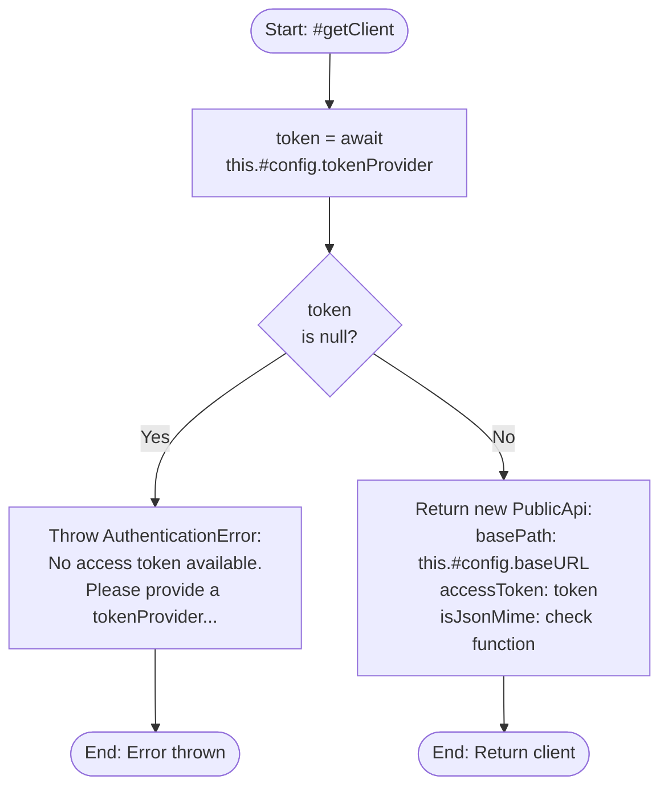
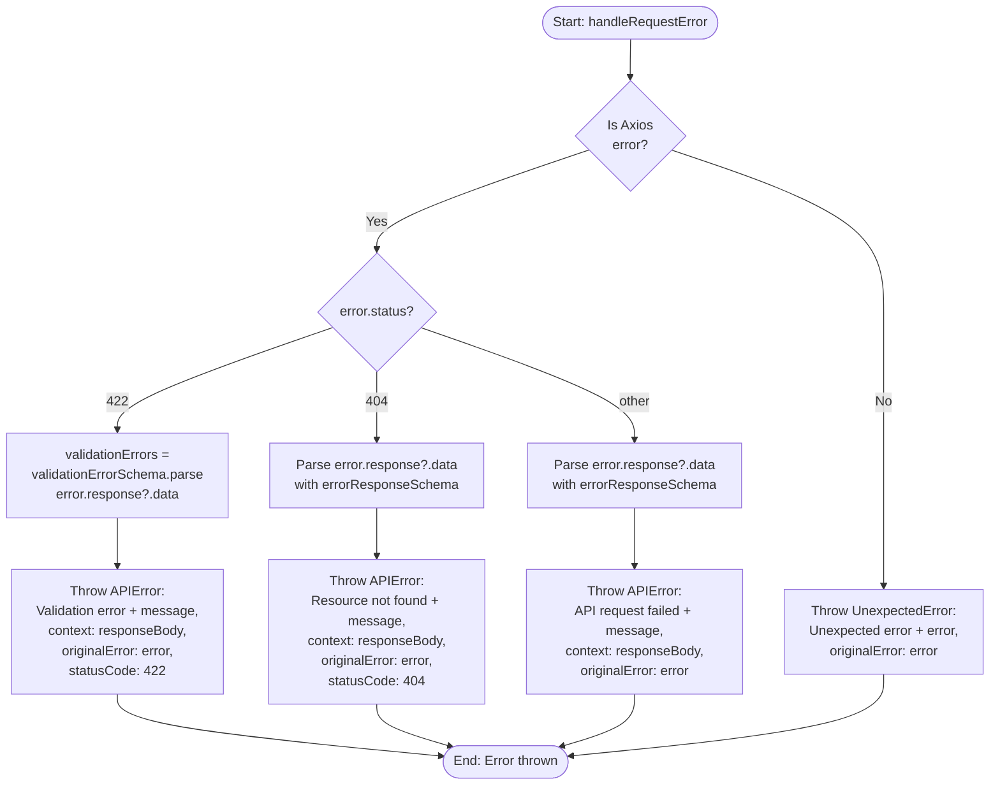
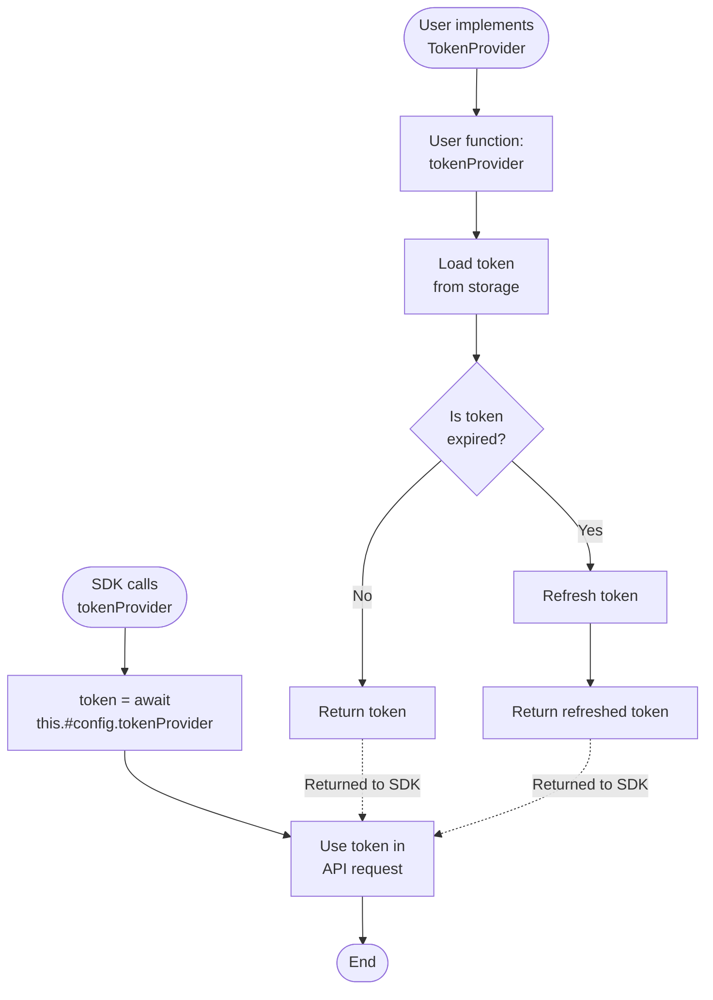

## 1. Purpose and Scope

### 1.1 Software Item Purpose

The SDK Library provides a TypeScript/JavaScript client library for interacting with the Aignostics Platform API. It implements a wrapper pattern around auto-generated OpenAPI clients, offering a simplified, type-safe interface for application discovery, application execution, run management, and results retrieval. The SDK handles authentication via customizable token providers, implements comprehensive error handling with structured error types, and provides request validation and response parsing using Zod schemas.

### 1.2 Scope

This specification covers:

- PlatformSDKHttp class implementing PlatformSDK interface
- Token provider pattern for flexible authentication
- Application discovery operations (list, get details, get versions)
- Application execution operations (create run, validate request)
- Run management operations (list, get details, cancel)
- Results retrieval operations
- Error handling with APIError, AuthenticationError, ConfigurationError, UnexpectedError
- HTTP client configuration (base URL, timeout, headers)
- Axios-based HTTP transport with error transformation
- Zod-based response validation for error responses

This specification excludes:

- OpenAPI code generation (automated external process)
- OAuth/OIDC implementation (handled by CLI or user code)
- Token storage and management (handled by CLI or user code)
- Token refresh logic (handled by tokenProvider implementation)
- CLI commands and user interfaces
- Server-side API implementation

## 2. Requirements Traceability

### 2.1 Parent Software Requirements

| SWR ID                            | Title                                    | Implementation Approach                                                                                                                                                |
| --------------------------------- | ---------------------------------------- | ---------------------------------------------------------------------------------------------------------------------------------------------------------------------- |
| SWR-AUTH-TOKEN-BASED              | Token-Based Authentication               | All API methods call #getClient() which invokes tokenProvider to get access token; token passed in Authorization header via OpenAPI client accessToken configuration   |
| SWR-AUTH-CUSTOM-PROVIDER          | Custom Token Provider                    | PlatformSDKConfig.tokenProvider accepts user function (sync or async) returning string or null; enables any authentication strategy                                    |
| SWR-APP-DISCOVERY-LIST            | Application List Retrieval               | listApplications() calls generated client.listApplicationsV1ApplicationsGet(); returns ApplicationReadShortResponse[] with id, name, description                       |
| SWR-APP-DISCOVERY-DETAILS         | Application Details Retrieval            | getApplication(applicationId) calls generated client.readApplicationByIdV1ApplicationsApplicationIdGet(); returns full ApplicationReadResponse with versions           |
| SWR-APP-DISCOVERY-VERSION-LIST    | Application Version List                 | Implemented via getApplication().versions; ApplicationReadResponse includes array of all versions with version_number and application_version_id                       |
| SWR-APP-DISCOVERY-VERSION-DETAILS | Application Version Details              | getApplicationVersionDetails(applicationId, version) calls generated client.applicationVersionDetailsV1ApplicationsApplicationIdVersionsVersionGet()                   |
| SWR-APP-EXEC-RUN-CREATION         | Application Run Creation                 | createApplicationRun(request) validates RunCreationRequest, calls generated client.createRunV1RunsPost(), returns RunCreationResponse with run ID                      |
| SWR-APP-EXEC-REQUEST-VALIDATION   | Application Execution Request Validation | Validation errors (422) caught by handleRequestError, parsed with Zod validationErrorSchema, thrown as APIError with validation details in context                     |
| SWR-APP-RUN-MGMT-LIST             | Application Run List                     | listApplicationRuns(options) supports filtering by applicationId and applicationVersion; calls generated client.listRunsV1RunsGet()                                    |
| SWR-APP-RUN-MGMT-DETAILS          | Application Run Details                  | getRun(applicationRunId) calls generated client.getRunV1RunsRunIdGet(); returns RunReadResponse with status, progress, metadata                                        |
| SWR-APP-RUN-MGMT-CANCEL           | Application Run Cancellation             | cancelApplicationRun(applicationRunId) calls generated client.cancelRunV1RunsRunIdCancelPost(); returns void on success                                                |
| SWR-APP-RESULTS-RETRIEVE-ITEMS    | Application Results Retrieval            | listRunResults(applicationRunId) calls generated client.listRunItemsV1RunsRunIdItemsGet(); returns ItemResultReadResponse[] with item status and data                  |
| SWR-ERROR-COMM-CLASSIFICATION     | Error Classification                     | Uses Error Management component; errors thrown as APIError, AuthenticationError, ConfigurationError, or UnexpectedError with appropriate error codes                   |
| SWR-ERROR-COMM-MESSAGES           | Error Messages                           | All error constructors accept descriptive message parameter; messages include context (e.g., "API request failed: {axiosMessage}", "Validation error: {axiosMessage}") |
| SWR-ERROR-COMM-DIAGNOSTIC-CONTEXT | Error Diagnostic Context                 | APIError includes statusCode property; handleRequestError adds responseBody to error context; originalError preserved for error chaining                               |

### 2.2 Requirements Coverage Analysis

All 15 SWRs fully implemented:

- **Authentication** (2 SWRs): Token provider pattern enables any auth strategy; token used in all API calls via Authorization header
- **Application Discovery** (4 SWRs): Complete CRUD operations for applications and versions via generated client methods
- **Application Execution** (2 SWRs): Run creation with request validation; 422 errors parsed and thrown with validation details
- **Run Management** (3 SWRs): List with filtering, get details, cancel operations
- **Results** (1 SWR): Item results retrieval with status and data
- **Error Communication** (3 SWRs): Structured error hierarchy from Error Management component; detailed context and diagnostic info

## 3. Design Specification

### 3.1 Architecture Overview

The SDK implements a wrapper pattern around OpenAPI-generated clients (PublicApi). The PlatformSDKHttp class provides a simplified interface with consistent error handling, token management via tokenProvider pattern, and validation using Zod schemas. Each method creates a fresh client instance with the current token, ensuring token freshness. The handleRequestError function transforms Axios errors into structured SDK error types with appropriate context.

**Architecture Diagram Reference**: See `/docs/SOFTWARE_ARCHITECTURE.md` Section 5.1 (SDK Package Structure) and Section 6.1 (API Request Flow)

### 3.2 Interfaces

#### 3.2.1 Public Interfaces

**Exported API**:

```typescript
// Token Provider Type
export type TokenProvider = () => Promise<string | null> | string | null;

// SDK Configuration
export interface PlatformSDKConfig {
  baseURL?: string; // Default: 'https://api.aignostics.com'
  tokenProvider: TokenProvider;
  timeout?: number; // Default: 10000ms
}

// SDK Interface
export interface PlatformSDK {
  getVersion(): string;
  getConfig(): PlatformSDKConfig;
  testConnection(): Promise<boolean>;

  // Application Discovery
  listApplications(): Promise<ApplicationReadShortResponse[]>;
  getApplication(applicationId: string): Promise<ApplicationReadResponse>;
  getApplicationVersionDetails(
    applicationId: string,
    version: string
  ): Promise<VersionReadResponse>;

  // Application Execution
  createApplicationRun(request: RunCreationRequest): Promise<RunCreationResponse>;

  // Run Management
  listApplicationRuns(options?: {
    applicationId?: string;
    applicationVersion?: string;
  }): Promise<RunReadResponse[]>;
  getRun(applicationRunId: string): Promise<RunReadResponse>;
  cancelApplicationRun(applicationRunId: string): Promise<void>;

  // Results Retrieval
  listRunResults(applicationRunId: string): Promise<ItemResultReadResponse[]>;
}

// SDK Implementation
export class PlatformSDKHttp implements PlatformSDK {
  constructor(config: PlatformSDKConfig);
  // ... methods implementing PlatformSDK interface
}

// Re-exported from generated code
export type {
  ApplicationReadShortResponse,
  ApplicationReadResponse,
  VersionReadResponse,
  RunCreationRequest,
  RunCreationResponse,
  RunReadResponse,
  ItemResultReadResponse,
  ItemCreationRequest,
};

// Re-exported from Error Management component
export { BaseError, AuthenticationError, APIError, ConfigurationError, UnexpectedError, ErrorCode };
```

#### 3.2.2 Internal Interfaces

**Internal Methods**:

```typescript
class PlatformSDKHttp {
  // Private config storage
  readonly #config: Readonly<PlatformSDKConfig>;

  // Private method to create client with current token
  async #getClient(): Promise<PublicApi>;
}

// Internal error handling
function handleRequestError(error: unknown): never;
```

**Validation Schemas** (Zod):

```typescript
const validationErrorSchema = z.object({
  detail: z.array(
    z.object({
      loc: z.array(z.union([z.string(), z.number()])),
      msg: z.string(),
      type: z.string(),
    })
  ),
});

const errorResponseSchema = z.union([validationErrorSchema, z.any()]);
```

#### 3.2.3 External Dependencies

**Third-Party Libraries**:
| Package | Version | Purpose | Justification |
|---------|---------|---------|---------------|
| axios | ^1.12.2 | HTTP client for API requests | Industry-standard HTTP client; Promise-based; interceptor support; TypeScript types; wide adoption |
| zod | ^4.0.17 | Runtime type validation for responses | Type-safe validation; clear error messages; composable schemas; minimal overhead |

**Internal Dependencies**:
| Package | Purpose |
|---------|---------|
| Error Management component | Structured error types (BaseError, APIError, AuthenticationError, etc.) |
| Generated OpenAPI client | PublicApi class with all API methods |

**Generated Code Dependency**:

- Source: `src/generated/` (auto-generated from OpenAPI spec)
- Generator: OpenAPI Generator v7.14.0 (Docker-based)
- Spec URL: https://platform-staging.aignostics.com/api/v1/openapi.json
- Update command: `nx codegen sdk`
- Generated files: PublicApi, request builders, response types, models

### 3.3 Data Structures

#### 3.3.1 Core Data Models

```typescript
// SDK Configuration (stored in #config)
interface PlatformSDKConfig {
  baseURL: string; // API base URL
  tokenProvider: TokenProvider; // Function to get access token
  timeout: number; // Request timeout in ms
}

// Application Models (from generated code)
interface ApplicationReadShortResponse {
  id: string; // Application ID
  name: string; // Display name
  description?: string; // Optional description
  regulatory_classes?: string[]; // Regulatory classifications
}

interface ApplicationReadResponse extends ApplicationReadShortResponse {
  versions: VersionReadShortResponse[]; // All available versions
  // ... additional fields
}

interface VersionReadResponse {
  version: string; // Version number (e.g., "v1.2.0")
  application_version_id: string; // Unique version ID
  changelog?: string; // Version changes
  release_date?: string; // ISO date string
  // ... additional fields
}

// Run Models (from generated code)
interface RunCreationRequest {
  application_id: string; // Application to run
  version_number: string; // Version to use
  items: ItemCreationRequest[]; // Input items
  // ... metadata fields
}

interface RunCreationResponse {
  id: string; // Unique run ID
  status: string; // Initial status (typically "pending")
  // ... additional fields
}

interface RunReadResponse {
  id: string; // Run ID
  application_id: string; // Application ID
  version_number: string; // Version used
  status: string; // Current status
  progress?: number; // Progress percentage
  created_at: string; // ISO timestamp
  // ... additional fields
}

interface ItemResultReadResponse {
  item_id: string; // Item identifier
  status: string; // Processing status
  data?: unknown; // Result data
  // ... additional fields
}
```

#### 3.3.2 Data Flow

**API Request Flow**:

1. User calls SDK method (e.g., `sdk.listApplications()`)
2. Method calls `await this.#getClient()` to get fresh client
3. #getClient() calls `await tokenProvider()` to get current token
4. If token is null, throw AuthenticationError
5. Create new PublicApi instance with token in configuration
6. Call generated client method (e.g., `client.listApplicationsV1ApplicationsGet()`)
7. Axios sends HTTP request with Authorization: Bearer {token}
8. Response received and parsed by generated client
9. Response data extracted from AxiosResponse
10. Data returned to caller
11. On error, catch and call handleRequestError for transformation

**Error Flow**:

1. Axios throws error (network, HTTP status, etc.)
2. Catch block calls handleRequestError(error)
3. If isAxiosError: check status code
4. 422 → Parse with validationErrorSchema, throw APIError with validation context
5. 404 → Throw APIError with "Resource not found" message
6. Other → Throw APIError with generic message and response body context
7. If not Axios error → Throw UnexpectedError with original error chained

### 3.4 Algorithms and Logic

#### 3.4.1 Core Algorithms

**Client Creation Algorithm**:



**Error Transformation Algorithm**:



**Token Provider Pattern**:



#### 3.4.2 State Management

**SDK State**: Minimal state - only config stored in private field

- Config is readonly after construction
- No caching of tokens or API responses
- No caching of client instances (created fresh per request)

**Stateless Design Benefits**:

- Thread-safe (no shared mutable state)
- Token always fresh (provider called each time)
- No stale data issues
- Simple testing (no state to reset)

#### 3.4.3 Control Flow

**Typical Request Flow**:

```
User Code
  ↓
SDK Method (e.g., listApplications)
  ↓
#getClient() [private method]
  ↓
tokenProvider() [user-provided function]
  ↓
new PublicApi({accessToken: token})
  ↓
Generated Client Method
  ↓
Axios HTTP Request
  ↓
Response or Error
  ↓
[Error Path] → handleRequestError → Throw Structured Error
  ↓
[Success Path] → Extract data → Return to User
```

### 3.5 Error Handling

#### 3.5.1 Error Classification

**SDK Error Types** (from Error Management component):

- **AuthenticationError**: No token from provider, token provider throws error
- **APIError**: HTTP errors (4xx, 5xx), network errors, response parsing errors
- **ConfigurationError**: Invalid SDK configuration (not currently thrown, reserved for future)
- **UnexpectedError**: Unknown errors, non-Axios errors

**HTTP Status Code Mapping**:

- 401 Unauthorized → APIError (triggers AuthenticationError in CLI if token refresh fails)
- 404 Not Found → APIError with "Resource not found" message
- 422 Unprocessable Entity → APIError with validation errors in context
- Other 4xx/5xx → APIError with generic message and response body

#### 3.5.2 Error Handling Strategy

**Centralized Error Handling**:

- All API methods use try-catch with handleRequestError
- Consistent error transformation across all endpoints
- Structured error context for debugging

**Error Context Enrichment**:

- APIError includes HTTP status code
- Validation errors (422) include detailed error locations and messages
- Original Axios error preserved in originalError field
- Response body parsed and included in context

**Token Provider Error Handling**:

- If tokenProvider throws → Error propagates to caller (SDK doesn't catch)
- If tokenProvider returns null → AuthenticationError thrown immediately
- Design assumption: tokenProvider handles its own error cases

#### 3.5.3 Error Recovery

**No Automatic Recovery**:

- SDK does not retry failed requests
- SDK does not refresh tokens (tokenProvider's responsibility)
- SDK does not implement circuit breakers or backoff

**Caller Responsibility**:

- Implement retry logic in application code
- Handle AuthenticationError by re-authenticating
- Handle APIError based on status code
- Implement exponential backoff for rate limiting

### 3.6 Security Considerations

#### 3.6.1 Authentication

**Token-Based Authentication**:

- Access tokens passed in Authorization: Bearer {token} header
- Token obtained via user-provided tokenProvider function
- No token storage or caching in SDK
- Token freshness responsibility of tokenProvider

**Token Provider Security**:

- TokenProvider can be async (supports token refresh)
- TokenProvider can return null (indicates no authentication)
- SDK throws AuthenticationError immediately if null returned
- No fallback or default tokens

#### 3.6.2 Authorization

Authorization enforced by API server - SDK only provides valid token. API returns 403 Forbidden for unauthorized operations.

#### 3.6.3 Data Protection

**Sensitive Data Handling**:

- Tokens never logged or included in error messages
- Response bodies included in error context (may contain sensitive data)
- Users responsible for sanitizing error context before logging

**HTTPS Enforcement**:

- Default baseURL uses https://
- Users can override baseURL (risk if using http://)
- No enforcement of HTTPS in SDK (trusts user configuration)

#### 3.6.4 Input Validation

**Request Validation**:

- TypeScript types provide compile-time validation
- Runtime validation by API server (422 errors)
- No client-side Zod validation of request bodies (future enhancement)

**Response Validation**:

- Error responses validated with Zod schemas
- Success responses not validated (trusts generated types)
- Invalid JSON responses cause UnexpectedError

## 4. Implementation Details

### 4.1 Technology Stack

**Languages**: TypeScript 5.8.3
**Runtime**: Node.js ≥22.14.0 (also browser-compatible)
**Build Tools**: tsup (bundler for CJS and ESM), tsc (type checking)
**Testing Framework**: Vitest with MSW (Mock Service Worker)
**API Client Generation**: OpenAPI Generator v7.14.0

### 4.2 File Structure

```
packages/sdk/src/
├── index.ts                     # Public exports (SDK, types, errors)
├── platform-sdk.ts              # PlatformSDKHttp implementation (450 lines)
├── errors.ts                    # Error classes (145 lines)
├── generated/                   # Auto-generated (git-ignored)
│   ├── index.ts                 # Generated exports
│   ├── api.ts                   # PublicApi class
│   ├── configuration.ts         # Client configuration
│   ├── common.ts                # Common utilities
│   └── models/                  # TypeScript models
└── test-utils/
    └── http-mocks.ts            # MSW mocks for testing
```

### 4.3 Key Components

| Component                    | Type           | Purpose                               | File Location           |
| ---------------------------- | -------------- | ------------------------------------- | ----------------------- |
| PlatformSDKHttp              | Class          | Main SDK implementation               | platform-sdk.ts:50-450  |
| #config                      | Private Field  | Readonly configuration storage        | platform-sdk.ts:52      |
| #getClient                   | Private Method | Create authenticated PublicApi client | platform-sdk.ts:65-78   |
| testConnection               | Method         | Verify API connectivity               | platform-sdk.ts:95-104  |
| listApplications             | Method         | List all applications                 | platform-sdk.ts:125-135 |
| getApplication               | Method         | Get application details               | platform-sdk.ts:195-205 |
| getApplicationVersionDetails | Method         | Get version details                   | platform-sdk.ts:160-175 |
| createApplicationRun         | Method         | Create new application run            | platform-sdk.ts:295-310 |
| listApplicationRuns          | Method         | List runs with optional filters       | platform-sdk.ts:250-265 |
| getRun                       | Method         | Get run details                       | platform-sdk.ts:335-345 |
| cancelApplicationRun         | Method         | Cancel running application            | platform-sdk.ts:370-380 |
| listRunResults               | Method         | Get run results                       | platform-sdk.ts:415-425 |
| getVersion                   | Method         | Get SDK version from package.json     | platform-sdk.ts:430-432 |
| getConfig                    | Method         | Get current SDK configuration         | platform-sdk.ts:445-447 |
| handleRequestError           | Function       | Transform Axios errors to SDK errors  | platform-sdk.ts:30-62   |

### 4.4 Configuration

**Default Configuration**:
| Parameter | Default Value | Description |
|-----------|---------------|-------------|
| baseURL | https://api.aignostics.com | Production API endpoint |
| timeout | 10000 | Request timeout in milliseconds |
| tokenProvider | (required) | User-provided function to get access token |

**Environment-Specific Endpoints**:
| Environment | Base URL |
|-------------|----------|
| Production | https://api.aignostics.com |
| Staging | https://platform-staging.aignostics.com |
| Development | (varies by setup) |

### 4.5 Dependencies Management

**Production Dependencies**:

- axios: HTTP client, allows minor and patch updates (^1.12.2)
- zod: Validation library, allows breaking changes in major updates (^4.0.17)

**Generated Code Dependency**:

- OpenAPI spec must be accessible at generation time
- Generated code committed to git (not runtime dependency)
- Regeneration required when API spec changes

## 5. Verification Criteria

### 5.1 Unit Test Requirements

**Test Coverage Areas**:

- [x] SDK construction with config
- [x] Token provider called on each request
- [x] AuthenticationError when tokenProvider returns null
- [x] All API methods with mocked responses
- [x] Error transformation for different HTTP status codes
- [x] Validation error parsing (422)
- [x] Resource not found handling (404)
- [x] Unexpected error handling
- [x] getVersion and getConfig methods
- [x] Request timeout handling

**Test Files**:

- `platform-sdk.test.ts`: Unit tests with MSW mocks
- `errors.test.ts`: Error class tests
- `index.test.ts`: Public API exports

### 5.2 Integration Test Requirements

**Integration Test Scenarios**:

- [x] Real API integration (staging environment)
- [x] Authentication flow with real tokens
- [x] Application discovery workflow
- [x] Application execution workflow
- [x] Run management operations
- [x] Results retrieval
- [x] Error scenarios with real API

**Test Files**:

- CLI E2E tests exercise SDK with real API
- `test-utils/http-mocks.ts`: Reusable MSW mocks for consumers

## 6. Risk Analysis

### 6.1 Identified Risks

| Risk                                                   | Probability | Impact | Mitigation Strategy                                                                          |
| ------------------------------------------------------ | ----------- | ------ | -------------------------------------------------------------------------------------------- |
| Token provider throws unexpected errors                | Medium      | High   | Document that tokenProvider must handle errors; consider adding error boundary in #getClient |
| Generated code out of sync with API spec               | Medium      | High   | Automated codegen in CI; version checks; regular regeneration schedule                       |
| Axios security vulnerabilities                         | Low         | High   | Regular npm audit; dependency updates; security scanning in CI                               |
| Response body in error context contains sensitive data | Medium      | Medium | Document sanitization responsibility; consider adding sanitization utilities                 |
| No request retry logic                                 | High        | Low    | Document as user responsibility; provide examples; consider adding retry middleware          |
| Large response bodies cause memory issues              | Low         | Medium | Document pagination recommendations; no streaming support yet                                |

### 6.2 Third-Party Library Risks (SOUP Analysis)

| Library       | Risk                                                | Mitigation                                                            |
| ------------- | --------------------------------------------------- | --------------------------------------------------------------------- |
| axios@^1.12.2 | Security vulnerabilities in HTTP client             | Regular updates; npm audit in CI; widely used and audited library     |
| axios         | Breaking changes in minor versions (despite semver) | Extensive test coverage; integration tests catch issues               |
| zod@^4.0.17   | Runtime overhead for validation                     | Only used for error parsing, not hot path; minimal performance impact |
| zod           | Breaking changes in major versions                  | Pin to ^4.x; test coverage ensures compatibility                      |

## 7. Maintenance and Evolution

### 7.1 Known Limitations

- No automatic request retry or exponential backoff
- No request/response logging or debugging hooks
- No streaming support for large responses
- No client-side request validation (only TypeScript types)
- No pagination utilities (users handle pagination manually)
- No rate limiting or throttling
- Token provider errors not caught or transformed
- No support for multiple concurrent token providers
