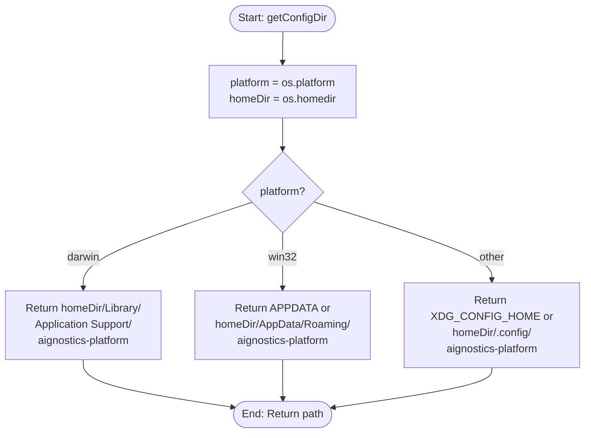
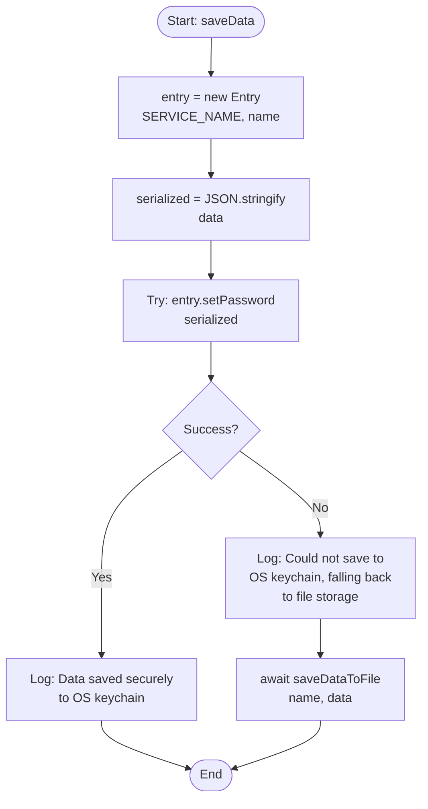

## 1. Purpose and Scope

### 1.1 Software Item Purpose
The Token Storage component provides cross-platform secure storage for authentication tokens using OS-native credential management systems. It implements a dual-strategy storage system with primary OS keychain storage and automatic fallback to encrypted file storage, ensuring secure token persistence with protection against unauthorized access across macOS, Linux, and Windows platforms.

### 1.2 Scope
This specification covers:
- OS-native secure storage using system keychain/credential manager
- File-based fallback storage with restricted permissions
- Generic JSON-serializable data storage interface (not token-specific)
- Cross-platform compatibility (macOS, Linux, Windows)
- Storage operations: save, load, check existence, remove
- TokenStorage interface implementation for authentication module integration

This specification excludes:
- Token validation logic (handled by AuthService)
- Token expiration checking (handled by AuthService)
- Token refresh mechanisms (handled by AuthService)
- OAuth/OIDC protocol implementation (handled by AuthService)
- Data encryption in file fallback (relies on OS file permissions)

## 2. Requirements Traceability

### 2.1 Parent Software Requirements
| SWR ID | Title | Implementation Approach |
|--------|-------|------------------------|
| SWR-AUTH-SECURE-STORAGE | Secure Token Storage | Implemented through OS-native keychain via @napi-rs/keyring with automatic fallback to file storage using 0o600 permissions (owner-only read/write); macOS uses Keychain, Linux uses libsecret, Windows uses Credential Manager |
| SWR-AUTH-TOKEN-REMOVAL | Token Removal | Implemented through removeData() function that deletes from both OS keychain and fallback file storage; exposed via TokenStorage.remove() interface method |
| SWR-AUTH-VALIDATION | Authentication Validation | Provides storage primitives (hasData, loadData) that AuthService uses to check token existence and validity; token validation logic implemented in AuthService using stored token data |

### 2.2 Requirements Coverage Analysis
All three SWRs are fully covered:
- **Secure Storage**: Primary storage via OS keychain provides maximum security; file fallback uses restrictive permissions (0o600) and platform-specific secure directories
- **Token Removal**: removeData() ensures complete removal from both storage layers; logout functionality enabled through this capability
- **Authentication Validation**: Storage layer provides data retrieval; validation logic in AuthService checks token existence, parses data, and verifies expiration using stored timestamps

## 3. Design Specification

### 3.1 Architecture Overview
The Token Storage component implements a layered storage strategy with automatic failover. The primary layer uses @napi-rs/keyring to interact with OS-native secure storage (Keychain on macOS, libsecret on Linux, Credential Manager on Windows). If keyring operations fail, the component automatically falls back to file-based storage in platform-specific secure directories with restricted permissions. The FileSystemTokenStorage class provides a clean interface for the authentication module, abstracting storage implementation details.

**Architecture Diagram Reference**: See `/docs/SOFTWARE_ARCHITECTURE.md` Section 5.2 (CLI Package Structure) and Section 8.4 (Security Architecture)

### 3.2 Interfaces

#### 3.2.1 Public Interfaces
**Exported API**:
```typescript
// Primary storage functions (dual-strategy)
export async function saveData(name: string, data: unknown): Promise<void>;
export async function loadData(name: string): Promise<unknown>;
export async function hasData(name: string): Promise<boolean>;
export async function removeData(name: string): Promise<void>;

// TokenStorage interface for dependency injection
export interface TokenStorage {
  save(name: string, data: Record<string, unknown>): Promise<void>;
  load(name: string): Promise<Record<string, unknown> | null>;
  remove(name: string): Promise<void>;
  exists(name: string): Promise<boolean>;
}

// FileSystemTokenStorage implementation
export class FileSystemTokenStorage implements TokenStorage {
  async save(name: string, data: Record<string, unknown>): Promise<void>;
  async load(name: string): Promise<Record<string, unknown> | null>;
  async remove(name: string): Promise<void>;
  async exists(name: string): Promise<boolean>;
}
```

#### 3.2.2 Internal Interfaces
**Internal Fallback Functions** (not exported):
```typescript
function getConfigDir(): string;
function ensureConfigDir(): string;
function getDataFilePath(name: string): string;
async function saveDataToFile(name: string, data: unknown): Promise<void>;
async function loadDataFromFile(name: string): Promise<unknown>;
async function removeDataFromFile(name: string): Promise<void>;
```

#### 3.2.3 External Dependencies
**Third-Party Libraries**:
| Package | Version | Purpose | Justification |
|---------|---------|---------|---------------|
| @napi-rs/keyring | ^1.1.8 | OS-native secure storage via native bindings | Industry-standard secure credential storage; actively maintained; provides uniform API across platforms; uses native OS security mechanisms |

**Internal Dependencies**:
| Package | Purpose |
|---------|---------|
| Node.js fs | File system operations for fallback storage |
| Node.js path | Platform-agnostic path manipulation |
| Node.js os | Platform detection and home directory resolution |

### 3.3 Data Structures

#### 3.3.1 Core Data Models
```typescript
// Service name constant for keyring identification
const SERVICE_NAME = 'aignostics-platform';

// Storage entry (OS keychain)
// Stored as JSON string in keyring Entry
interface Entry {
  serviceName: string;  // 'aignostics-platform'
  accountName: string;  // User-provided name (e.g., 'production', 'staging')
  password: string;     // JSON.stringify(data)
}

// File storage structure
// Located at platform-specific paths:
// - macOS: ~/Library/Application Support/aignostics-platform/
// - Linux: ~/.config/aignostics-platform/
// - Windows: %APPDATA%/aignostics-platform/
interface FileStorage {
  directory: string;    // Platform-specific config directory
  filename: string;     // {sanitized_name}.json
  permissions: number;  // 0o600 (owner read/write only)
  content: string;      // JSON.stringify(data, null, 2)
}

// Generic stored data (unknown type)
// Callers are responsible for validation (e.g., using Zod)
type StoredData = unknown;
```

#### 3.3.2 Data Flow
**Save Operation**:
1. Accept name and data parameters
2. Serialize data to JSON string
3. Attempt OS keychain storage via Entry.setPassword()
4. If keychain fails, fall back to file storage with 0o600 permissions
5. Log success/warning message

**Load Operation**:
1. Accept name parameter
2. Attempt OS keychain retrieval via Entry.getPassword()
3. If found, deserialize JSON and return
4. If not found or fails, attempt file fallback
5. Parse and return data, or return null if not found

**Remove Operation**:
1. Accept name parameter
2. Attempt OS keychain deletion via Entry.deletePassword()
3. Also attempt file removal (ensures both layers cleaned)
4. Log success/warning message

### 3.4 Algorithms and Logic

#### 3.4.1 Core Algorithms
**Platform-Specific Directory Resolution**:


**Name Sanitization** (prevents path traversal):
```mermaid
flowchart TD
    Start([Start: sanitizeName]) --> Replace[Replace all characters<br/>not matching /[a-zA-Z0-9_-]/<br/>with underscore]
    Replace --> Return[Return sanitized name]
    Return --> End([End])
```

**Dual-Strategy Storage Algorithm**:


#### 3.4.2 State Management
Storage component is stateless - each operation is independent. No in-memory caching or state retention between calls.

#### 3.4.3 Control Flow
All operations follow try-catch pattern with automatic fallback:
1. Attempt OS keychain operation
2. On success: return/log success
3. On failure: fallback to file operation
4. On file failure: throw error or return null

### 3.5 Error Handling

#### 3.5.1 Error Classification
**Error Types**:
- **Keyring Unavailable**: OS keychain not accessible (permissions, service not running)
- **File System Error**: Cannot create directory, write file, or set permissions
- **JSON Parse Error**: Stored data is corrupted or not valid JSON
- **Permission Denied**: Insufficient permissions to access keychain or file system

#### 3.5.2 Error Handling Strategy
**Graceful Degradation**:
- Keyring failures automatically fall back to file storage
- File read failures return null (treated as "not found")
- Parse errors return null with warning log
- Errors are logged to console with warning level, not thrown

**Exception Throwing**:
- saveDataToFile throws Error if file write fails completely
- Other operations return null or false rather than throwing

#### 3.5.3 Error Recovery
**Automatic Recovery**:
- Keyring failure → File fallback
- Directory missing → Create with recursive: true and mode: 0o700
- File not found → Return null (valid "not stored" state)

**Manual Recovery**:
- Users can manually delete corrupted files from config directory
- Logout and re-login recovers from most corruption scenarios

### 3.6 Security Considerations

#### 3.6.1 Authentication
This component stores authentication data but does not perform authentication. Token validation handled by AuthService.

#### 3.6.2 Authorization
File permissions enforce access control:
- Directory: 0o700 (owner read/write/execute only)
- Files: 0o600 (owner read/write only)
- OS keychain enforces user-level isolation via OS security

#### 3.6.3 Data Protection
**OS Keychain Protection** (Primary):
- macOS: Keychain encryption with user password
- Linux: libsecret encryption via GNOME Keyring or KWallet
- Windows: Credential Manager encryption with user profile

**File Fallback Protection**:
- Restrictive permissions (0o600) prevent other users from reading
- Stored in user-specific directories
- No encryption beyond OS file system permissions
- JSON format (no additional obfuscation)

**Limitations**:
- File fallback less secure than OS keychain
- Root/Administrator users can access file storage
- No protection against malware running as user
- No encryption key rotation

#### 3.6.4 Input Validation
**Name Sanitization**:
- Input names sanitized to prevent path traversal
- Regex: `/[^a-zA-Z0-9_-]/g` replaced with `_`
- Prevents injection of `.., /, \` characters

**Data Validation**:
- No validation of stored data content
- Caller responsible for validation (e.g., Zod schema)
- JSON serialization may fail for non-serializable data (functions, circular references)

## 4. Implementation Details

### 4.1 Technology Stack
**Languages**: TypeScript 5.8.3
**Runtime**: Node.js ≥18.0.0
**Build Tools**: tsup (bundler), tsc (type checking)
**Testing Framework**: Vitest
**Native Bindings**: @napi-rs/keyring (Rust-based native modules)

### 4.2 File Structure
```
packages/cli/src/utils/
└── token-storage.ts         # Token storage implementation (270 lines)
    ├── OS keychain functions (saveData, loadData, hasData, removeData)
    ├── File fallback functions (private)
    └── FileSystemTokenStorage class
```

### 4.3 Key Components
| Component | Type | Purpose | File Location |
|-----------|------|---------|---------------|
| SERVICE_NAME | Constant | Keyring service identifier | token-storage.ts:46 |
| saveData | Function | Save data to OS keychain with file fallback | token-storage.ts:52-64 |
| loadData | Function | Load data from OS keychain with file fallback | token-storage.ts:70-96 |
| hasData | Function | Check if data exists in storage | token-storage.ts:101-104 |
| removeData | Function | Remove data from both storage layers | token-storage.ts:109-125 |
| getConfigDir | Function | Get platform-specific config directory | token-storage.ts:130-148 |
| ensureConfigDir | Function | Create config directory if missing | token-storage.ts:153-162 |
| getDataFilePath | Function | Get sanitized file path for data storage | token-storage.ts:167-172 |
| saveDataToFile | Function | File storage implementation | token-storage.ts:177-186 |
| loadDataFromFile | Function | File retrieval implementation | token-storage.ts:191-207 |
| removeDataFromFile | Function | File deletion implementation | token-storage.ts:212-222 |
| FileSystemTokenStorage | Class | TokenStorage interface implementation | token-storage.ts:228-245 |

### 4.4 Configuration
**Platform-Specific Paths**:
| Platform | Config Directory | Environment Override |
|----------|-----------------|---------------------|
| macOS | ~/Library/Application Support/aignostics-platform | None |
| Linux | ~/.config/aignostics-platform | XDG_CONFIG_HOME |
| Windows | %APPDATA%\aignostics-platform | APPDATA |

**File Permissions**:
| Resource | Permission | Octal | Description |
|----------|-----------|-------|-------------|
| Directory | rwx------ | 0o700 | Owner full access |
| Data files | rw------- | 0o600 | Owner read/write only |

### 4.5 Dependencies Management
**@napi-rs/keyring dependency**:
- Version: ^1.1.8 (allows minor and patch updates)
- Platform-specific builds included in package
- Requires native compilation for development (handled automatically)
- Fallback ensures functionality even if native module fails

## 5. Verification Criteria

### 5.1 Unit Test Requirements

**Test Coverage Areas**:
- [x] OS keychain save/load/remove operations
- [x] File fallback when keychain unavailable
- [x] Directory creation with correct permissions
- [x] Name sanitization prevents path traversal
- [x] JSON serialization/deserialization
- [x] Parse error handling
- [x] Cross-platform path resolution
- [x] FileSystemTokenStorage interface compliance
- [x] Null return on missing data

**Test Files**:
- `token-storage.spec.ts`: Unit tests for token storage (mocked keyring)

### 5.2 Integration Test Requirements

**Integration Test Scenarios**:
- [x] Real OS keychain integration (platform-specific)
- [x] Fallback behavior on keyring failure
- [x] AuthService integration with TokenStorage
- [x] CLI login/logout flow with token persistence
- [x] Token retrieval after process restart

**Test Files**:
- `auth.spec.ts`: AuthService integration with token storage
- `1-Authentication.e2e.test.ts`: End-to-end authentication flow

## 6. Risk Analysis

### 6.1 Identified Risks
| Risk | Probability | Impact | Mitigation Strategy |
|------|------------|--------|---------------------|
| OS keychain unavailable or permission denied | Medium | Medium | Automatic fallback to file storage with user notification |
| File storage readable by root/admin users | High | Medium | Primary storage uses OS keychain; file fallback documented as less secure |
| Malware running as user can access tokens | Medium | High | OS-level security responsibility; consider token expiration and rotation |
| Native module compilation fails on some platforms | Low | Medium | Fallback ensures functionality; pre-built binaries for common platforms |
| Directory permissions reset by other tools | Low | Low | Permissions set on each directory creation |
| JSON circular reference causes serialization failure | Low | Low | Documented that data must be JSON-serializable; callers control data structure |

### 6.2 Third-Party Library Risks (SOUP Analysis)
| Library | Risk | Mitigation |
|---------|------|------------|
| @napi-rs/keyring@^1.1.8 | Native binary dependency may have platform-specific issues | Automated fallback to file storage; extensive cross-platform testing; actively maintained by napi-rs team |
| @napi-rs/keyring | Native code could have security vulnerabilities | Regular updates via npm audit; reputable maintainer (napi-rs); open source code review |
| @napi-rs/keyring | Breaking changes in minor versions | Semver caret (^) allows minor updates; integration tests catch breaking changes |

## 7. Maintenance and Evolution

### 7.1 Known Limitations
- File fallback does not encrypt data beyond OS file system permissions
- No built-in token expiration or validation (handled by AuthService)
- No automatic migration from file to keychain when keychain becomes available
- No support for multi-user token sharing (by design - user-specific storage)
- JSON serialization limits storable data types (no functions, circular references)
