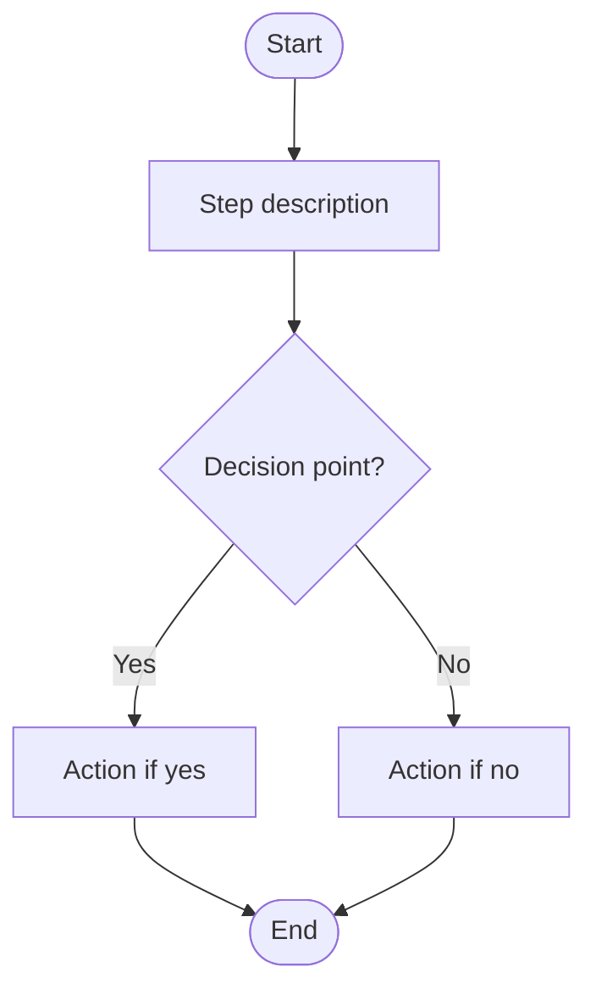
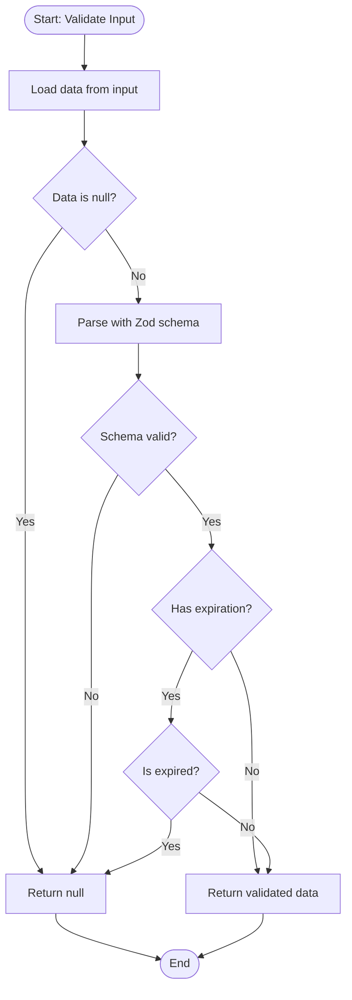
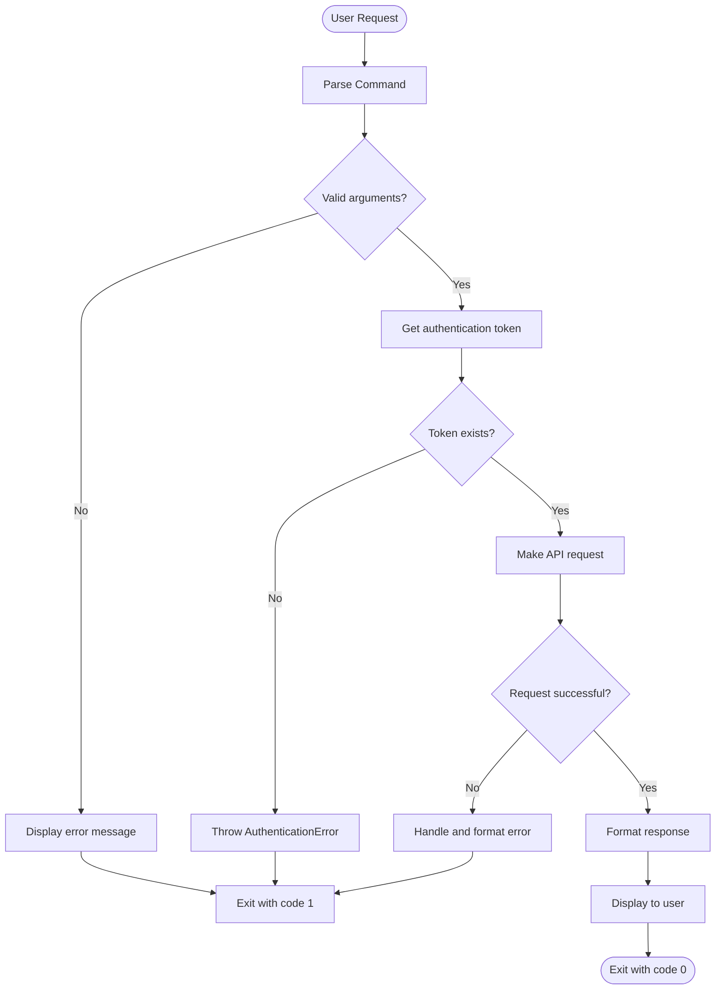

# Template inherited from IEC 62304 Medical Software Development
# Software Item Specification Template

**Purpose**: Use this template to create Software Item Specifications (SIS) - detailed design specifications for software components that implement Software Requirements (SWR).

## Template Structure

```markdown
---
itemId: SPEC-[COMPONENT-NAME]
itemTitle: [Component Name] Software Item Specification
itemType: Software Item Spec
itemFulfills: SWR-[ID-1], SWR-[ID-2], SWR-[ID-3]
itemIsRelatedTo: SPEC-[RELATED-SPEC-1], SPEC-[RELATED-SPEC-2]
Module: [SDK|CLI|TokenStorage|ErrorManagement]
Layer: [SDK Library|CLI Application|Infrastructure Service|Error Handling Framework]
Date: YYYY-MM-DD
---

## 1. Purpose and Scope

### 1.1 Software Item Purpose
[Clear statement of what this software item does and its role in the system. 2-3 sentences.]

### 1.2 Scope
[Define what is included and excluded from this specification. List key responsibilities and boundaries.]

## 2. Requirements Traceability

### 2.1 Parent Software Requirements
| SWR ID | Title | Implementation Approach |
|--------|-------|------------------------|
| SWR-XX-YY | [Requirement Title] | [How this software item implements the requirement] |
| SWR-XX-ZZ | [Requirement Title] | [How this software item implements the requirement] |

### 2.2 Requirements Coverage Analysis
[Brief explanation of how all listed SWRs are covered by this specification]

## 3. Design Specification

### 3.1 Architecture Overview
[High-level description of the component architecture. Reference the Software Architecture Document section if applicable.]

**Architecture Diagram Reference**: See `/docs/SOFTWARE_ARCHITECTURE.md` Section [X.X]

### 3.2 Interfaces

#### 3.2.1 Public Interfaces
[List all exported functions, classes, types, and interfaces]

**Exported API**:
```typescript
// List key public interfaces
```

#### 3.2.2 Internal Interfaces
[Describe internal APIs used within the component but not exposed externally]

#### 3.2.3 External Dependencies
**Third-Party Libraries**:
| Package | Version | Purpose | Justification |
|---------|---------|---------|---------------|
| package-name | ^x.y.z | Purpose | Why we use it |

**Internal Dependencies**:
| Package | Purpose |
|---------|---------|
| @aignostics/package | Purpose |

### 3.3 Data Structures

#### 3.3.1 Core Data Models
```typescript
// Key interfaces, types, and data structures
```

#### 3.3.2 Data Flow
[Describe how data flows through the component]

### 3.4 Algorithms and Logic

#### 3.4.1 Core Algorithms
[Describe key algorithms using Mermaid flowcharts. Each algorithm should be represented as a flowchart diagram for clarity and visual understanding.]

**Algorithm Name**:


**Example: Data Validation Algorithm**:


#### 3.4.2 State Management
[How state is managed, if applicable. Describe any stateful operations.]

#### 3.4.3 Control Flow
[Describe the main control flow and decision points using Mermaid flowcharts for complex flows]

**Example: Request Processing Flow**:


### 3.5 Error Handling

#### 3.5.1 Error Classification
[List error types and categories]

**Error Types**:
- **ErrorType1**: Description and when it occurs
- **ErrorType2**: Description and when it occurs

#### 3.5.2 Error Handling Strategy
[Describe how errors are caught, transformed, and propagated]

#### 3.5.3 Error Recovery
[Describe recovery mechanisms, if any]

### 3.6 Security Considerations

#### 3.6.1 Authentication
[How authentication is handled]

#### 3.6.2 Authorization
[How authorization is enforced]

#### 3.6.3 Data Protection
[Encryption, sanitization, secure storage mechanisms]

#### 3.6.4 Input Validation
[Validation approach and sanitization methods]

## 4. Implementation Details

### 4.1 Technology Stack
**Languages**: TypeScript [version]
**Runtime**: Node.js ≥18.0.0
**Build Tools**: [List build tools]
**Testing Framework**: [Testing tools]

### 4.2 File Structure
```
packages/[package]/src/
├── file1.ts                # Purpose and description
├── file2.ts                # Purpose and description
└── utils/
    └── helper.ts           # Purpose and description
```

### 4.3 Key Components
| Component | Type | Purpose | File Location |
|-----------|------|---------|---------------|
| ClassName | Class | What it does | file.ts:line |
| functionName | Function | What it does | file.ts:line |

### 4.4 Configuration
| Parameter | Type | Default Value | Description |
|-----------|------|---------------|-------------|
| param1 | type | value | What it controls |

### 4.5 Dependencies Management
[Describe how dependencies are managed and version constraints]

## 5. Verification Criteria

### 5.1 Unit Test Requirements

**Test Coverage Areas**:
- [ ] Core functionality paths
- [ ] Error handling paths
- [ ] Edge cases and boundary conditions
- [ ] Input validation
- [ ] Output verification

**Test Files**:
- `file.spec.ts`: Unit tests for [component]

### 5.2 Integration Test Requirements

**Integration Test Scenarios**:
- [ ] Integration scenario 1
- [ ] Integration scenario 2
- [ ] Error path integration

**Test Files**:
- `file.test.ts`: Integration tests for [component]

## 6. Risk Analysis

### 6.1 Identified Risks
| Risk | Probability | Impact | Mitigation Strategy |
|------|------------|--------|---------------------|
| [Risk description] | Low/Medium/High | Low/Medium/High | [How we mitigate it] |

### 6.2 Third-Party Library Risks (SOUP Analysis)
| Library | Risk | Mitigation |
|---------|------|------------|
| package@version | [Risk description] | [How we address it] |

## 7. Maintenance and Evolution

### 7.1 Known Limitations
[Document current limitations and constraints]


### CLI Component
```yaml
itemFulfills: SWR-AUTH-CODE-FLOW, SWR-AUTH-SECURE-STORAGE, SWR-AUTH-AUTO-REFRESH, SWR-AUTH-TOKEN-REMOVAL, SWR-AUTH-VALIDATION, SWR-ERROR-COMM-CLI-OUTPUT
```

### TokenStorage Component
```yaml
itemFulfills: SWR-AUTH-SECURE-STORAGE, SWR-AUTH-TOKEN-REMOVAL, SWR-AUTH-VALIDATION
```

### ErrorManagement Component
```yaml
itemFulfills: SWR-ERROR-COMM-CLASSIFICATION, SWR-ERROR-COMM-MESSAGES, SWR-ERROR-COMM-DIAGNOSTIC-CONTEXT, SWR-ERROR-COMM-CLI-OUTPUT
```
